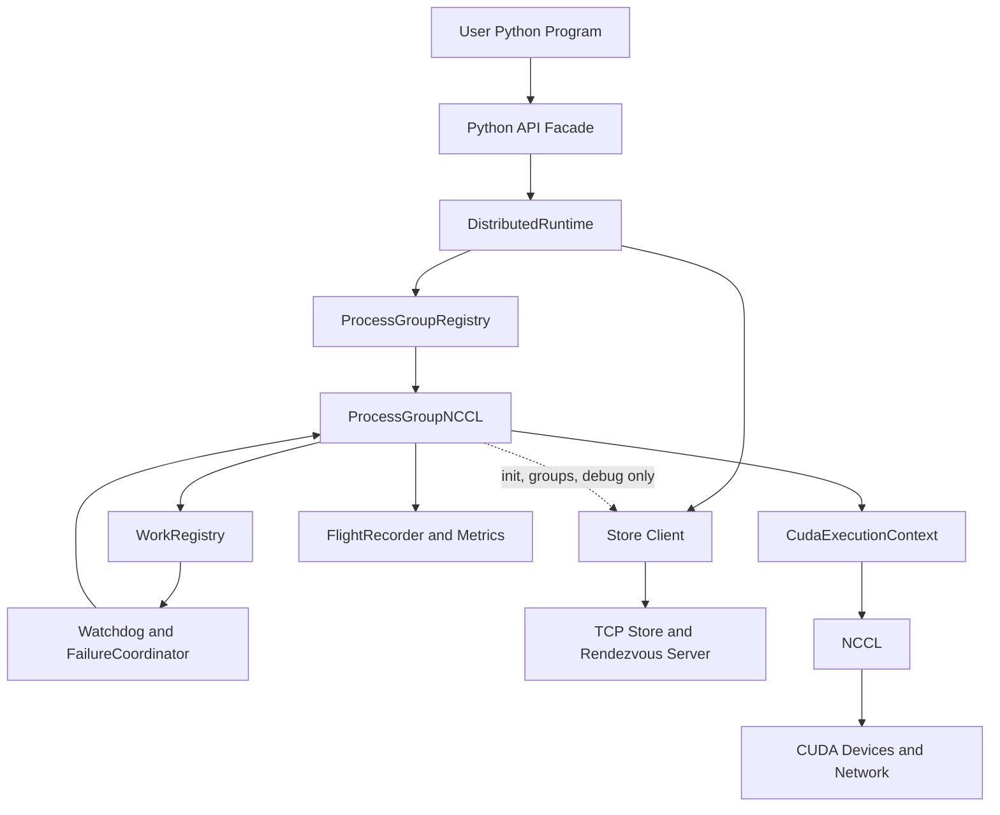
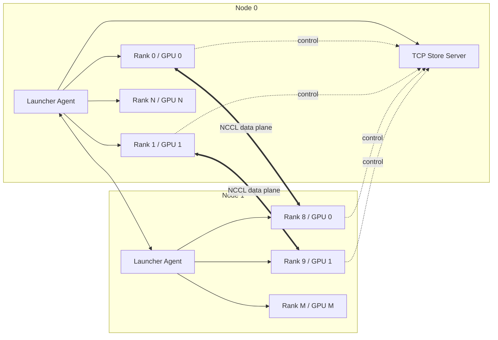
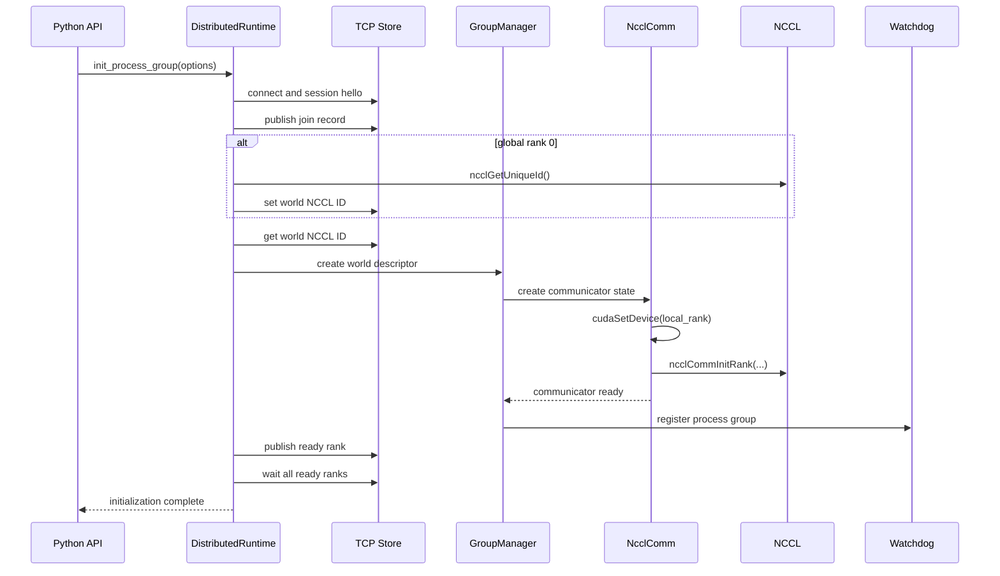
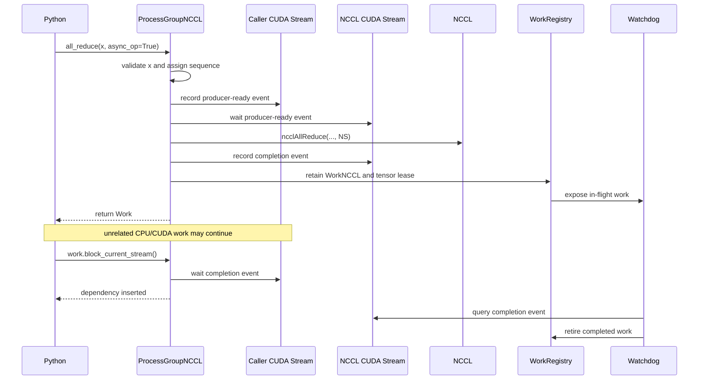
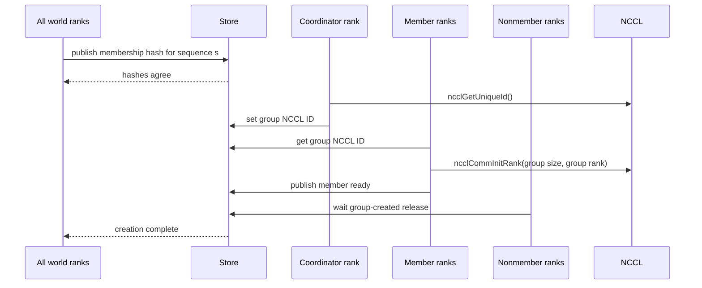
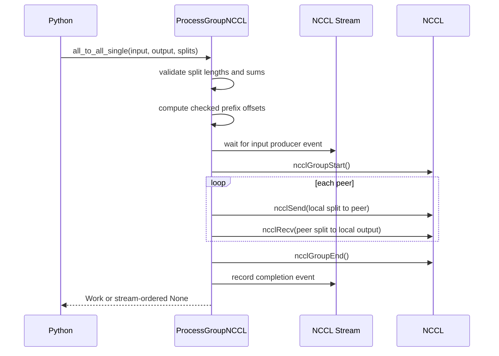
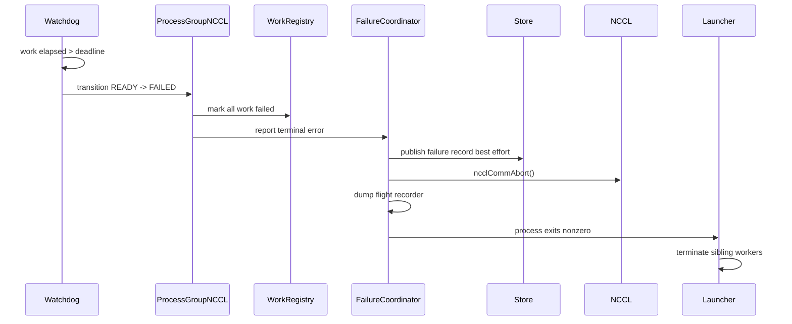
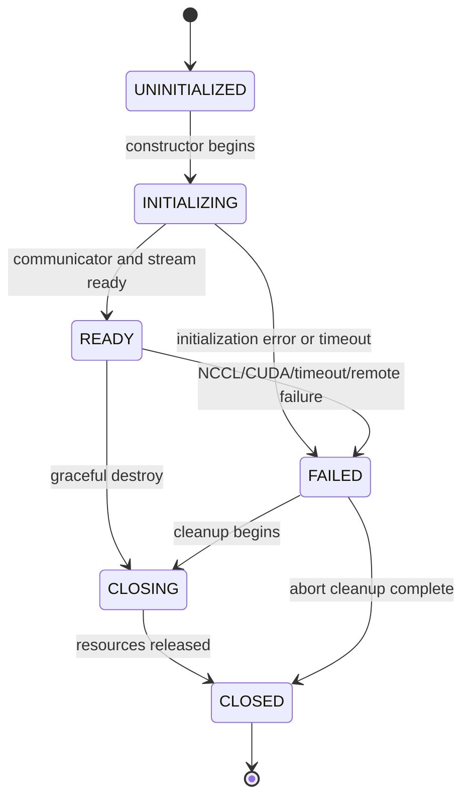

# NCCLDist Design Specification

## A `torch.distributed`-like runtime built directly on CUDA and NCCL

**Status:** Implementation-ready design draft  
**Audience:** Engineers implementing the Python API, C++ runtime, CUDA integration, rendezvous service, launcher, and reliability tooling  
**Primary package name used in this document:** `nccldist`  
**Execution model:** Static SPMD, one process per GPU, one CUDA device per process  
**Data plane:** NCCL  
**Control plane:** TCP Store by default; optional MPI bootstrap adapter  
**Tensor frontend:** `torch.Tensor`, without using `torch.distributed`

---

## Table of contents

1. [Executive summary](#1-executive-summary)
2. [Goals, non-goals, and design decisions](#2-goals-non-goals-and-design-decisions)
3. [Terminology and invariants](#3-terminology-and-invariants)
4. [System architecture](#4-system-architecture)
5. [Component ownership and dependency rules](#5-component-ownership-and-dependency-rules)
6. [Public Python API specification](#6-public-python-api-specification)
7. [Collective semantics and NCCL mappings](#7-collective-semantics-and-nccl-mappings)
8. [C++ core API and object model](#8-c-core-api-and-object-model)
9. [Core services](#9-core-services)
10. [Control-plane design](#10-control-plane-design)
11. [End-to-end execution flows](#11-end-to-end-execution-flows)
12. [CUDA stream and memory-lifetime model](#12-cuda-stream-and-memory-lifetime-model)
13. [Concurrency and ordering model](#13-concurrency-and-ordering-model)
14. [Failure model, watchdog, and teardown](#14-failure-model-watchdog-and-teardown)
15. [Wire protocol for the TCP Store](#15-wire-protocol-for-the-tcp-store)
16. [Configuration and environment variables](#16-configuration-and-environment-variables)
17. [Observability and debugging](#17-observability-and-debugging)
18. [Repository and build layout](#18-repository-and-build-layout)
19. [Testing plan](#19-testing-plan)
20. [Performance plan](#20-performance-plan)
21. [Implementation roadmap](#21-implementation-roadmap)
22. [Version 1 definition of done](#22-version-1-definition-of-done)
23. [Worked examples](#23-worked-examples)
24. [Appendix: implementation skeletons](#24-appendix-implementation-skeletons)
25. [References](#25-references)

---

# 1. Executive summary

NCCL gives the library a highly optimized GPU communication data plane, but it does not provide a complete distributed runtime. The implementation therefore has two layers:

1. **Control plane**
   - Discovers ranks and devices.
   - Assigns a unique run identity.
   - Exchanges `ncclUniqueId` values.
   - Creates subgroups.
   - Coordinates barriers used for debugging and lifecycle management.
   - Propagates failure information.

2. **Data plane**
   - Owns NCCL communicators.
   - Launches collectives and point-to-point operations on CUDA streams.
   - Preserves producer-to-communication and communication-to-consumer ordering.
   - Keeps tensor allocations alive while communication is in flight.
   - Returns asynchronous `Work` handles.
   - Detects NCCL, CUDA, timeout, and remote-rank failures.

The intended public interface looks familiar to users of `torch.distributed`:

```python
import os
import torch
import nccldist as dist

local_rank = int(os.environ["LOCAL_RANK"])
torch.cuda.set_device(local_rank)

dist.init_process_group(
    backend="nccl",
    init_method="env://",
)

x = torch.full(
    (1024,),
    float(dist.get_rank() + 1),
    device="cuda",
)

work = dist.all_reduce(
    x,
    op=dist.ReduceOp.SUM,
    async_op=True,
)

# Launch unrelated CUDA work here.

work.block_current_stream()
y = x * 2

dist.destroy_process_group()
```

The fast path for an asynchronous collective is:

```text
Python API
   -> resolve process group
   -> validate tensor and operation
   -> assign process-group sequence number
   -> record producer event on caller CUDA stream
   -> make persistent NCCL stream wait on producer event
   -> enqueue NCCL operation
   -> record completion event on NCCL stream
   -> retain tensor storage
   -> register WorkNCCL with watchdog/reaper
   -> return Work to Python
```

The TCP Store is not consulted during normal collective execution. It is used only for initialization, group creation, monitored barriers, debug fingerprint exchange, and failure notification.

---

# 2. Goals, non-goals, and design decisions

## 2.1 Goals

Version 1 must provide:

- A Python API close to the core `torch.distributed` API.
- CUDA tensor communication through NCCL.
- Single-node and multi-node operation.
- One process per GPU.
- Static rank membership.
- A default world process group and arbitrary subgroups.
- Synchronous and asynchronous collective APIs.
- Point-to-point send and receive.
- Equal-sized and variable-sized all-to-all.
- Correct CUDA stream ordering.
- Correct tensor allocation lifetime.
- Bounded operation timeouts.
- Clear errors instead of indefinite silent hangs whenever the runtime can diagnose the problem.
- Debug tooling for collective desynchronization.
- Performance close to raw NCCL for large messages.

## 2.2 Non-goals for version 1

The following are intentionally deferred:

- CPU collectives or a Gloo-like backend.
- Elastic rank joins and leaves.
- Continuing training after a rank failure.
- Multi-GPU-per-process execution.
- Noncontiguous tensor packing.
- Python object collectives such as `broadcast_object_list`.
- Message tags beyond `tag=0` for NCCL point-to-point operations.
- Custom ring, tree, NVLS, or transport algorithms.
- CUDA Graph capture.
- Device-initiated communication.
- One-sided NCCL communication.
- Automatic DDP gradient bucketing.
- A `DeviceMesh` or distributed tensor layer.
- ABI compatibility with arbitrary PyTorch builds. The extension must be built against the active PyTorch installation.

## 2.3 Design decisions

| ID | Decision | Rationale |
|---|---|---|
| D1 | One process owns one CUDA device. | It gives the simplest rank-to-device model and avoids multi-device launch complexity. |
| D2 | The public tensor type is `torch.Tensor`. | It avoids building a CUDA allocator, dtype system, and Python tensor object before the distributed runtime exists. |
| D3 | The library does not call `torch.distributed`. | The objective is to own rendezvous, process groups, work tracking, and NCCL launch behavior. |
| D4 | The control plane and data plane are separate. | NCCL communicates tensor data; a Store communicates IDs, metadata, and failures. |
| D5 | Each process group owns one persistent CUDA communication stream. | It enables compute/communication overlap while preserving a simple per-group order. |
| D6 | Host-side launches on one process group are serialized. | Deterministic local issue order is more important than concurrent host enqueue in version 1. |
| D7 | Public roots and peers are global ranks. | This matches the user mental model; the group translates them to communicator-local ranks. |
| D8 | Group creation is collective over the world and ordered globally in version 1. | It prevents different ranks from associating different NCCL IDs with the same logical group. |
| D9 | Membership is static and failures are fail-stop. | Recreating a coherent optimizer/model state after rank loss is outside version 1. |
| D10 | `async_op=False` is CUDA-stream synchronous, not necessarily CPU synchronous. | The caller stream is ordered after communication without forcing a device-wide or host wait. |
| D11 | `barrier(async_op=False)` is host blocking. | A process barrier should not return before all participating processes have arrived. |
| D12 | Version 1 uses blocking NCCL communicators; nonblocking communicator mode is a hardening milestone. | It keeps launch/event semantics simple while the core runtime is being validated. |
| D13 | The runtime retains every in-flight tensor until the completion event fires. | This is the simplest allocator-safe lifetime policy. |
| D14 | Production collectives do not exchange metadata through the Store. | Store round trips would destroy latency and scalability. |
| D15 | Debug mode may exchange operation fingerprints before launch. | It converts many silent hangs into actionable mismatch reports. |

## 2.4 Compatibility target

The API is intentionally familiar but is not initially guaranteed to be a drop-in replacement for every `torch.distributed` behavior. Compatibility is divided into three levels:

- **Source familiarity:** names and argument structure are similar.
- **Behavioral compatibility:** tensor results, rank semantics, and async behavior are documented and stable.
- **Drop-in compatibility:** deferred until a dedicated compatibility suite exists.

A later adapter can register the same C++ backend with PyTorch's process-group plugin interface. The standalone package should remain the primary implementation so its lifecycle and diagnostics are not constrained by another runtime.

---

# 3. Terminology and invariants

## 3.1 Terms

| Term | Meaning |
|---|---|
| Global rank | Rank in the default world process group, in `[0, WORLD_SIZE)`. |
| Group rank | Rank inside a subgroup, in `[0, group_size)`. |
| Local rank | Process index among workers on the same host; normally maps to a CUDA device ordinal. |
| World size | Number of global ranks. |
| Process group | An ordered set of global ranks plus a communication backend. |
| Communicator | An `ncclComm_t` associated with one group rank and one CUDA device. |
| Store | A small CPU-side key-value service used for rendezvous and coordination. |
| Work | A handle representing an enqueued asynchronous operation. |
| Caller stream | The CUDA stream active when the Python collective is invoked. |
| Communication stream | Persistent CUDA stream owned by a process group and used for NCCL operations. |
| Sequence number | Monotonic operation number local to one process group. |
| Fingerprint | Debug record describing operation type, count, dtype, root/peer, and options. |

## 3.2 Non-negotiable invariants

1. **Rank-device binding is stable.** A communicator rank is permanently associated with the CUDA device selected before communicator initialization.
2. **NCCL counts are element counts, not byte counts.** Byte size is `numel * element_size` only for diagnostics and metrics.
3. **All ranks issue compatible operations in compatible order.** A local mutex cannot repair divergent control flow between processes.
4. **The NCCL stream waits for the producer stream.** NCCL must not read a tensor before the kernel that produced it completes.
5. **Consumers wait for NCCL completion.** A consumer kernel must not read the result until the communication completion event has been observed.
6. **Tensor storage remains valid until communication completes.** Dropping a Python variable must not permit allocator reuse while NCCL is using the allocation.
7. **A fatal communicator error poisons the process group.** New work is rejected after the transition to `FAILED`.
8. **Subgroup rank translation is explicit.** NCCL roots and peers are communicator-local even when the Python API accepts global ranks.
9. **No Store operation is placed on the production collective fast path.** Only debug mode is allowed to violate this rule.
10. **Shutdown cannot race with launch.** Group state and the launch mutex must prevent new NCCL calls after closing starts.

---

# 4. System architecture

## 4.1 Top-level architecture



## 4.2 Deployment architecture



The launchers only create and supervise worker processes. Tensor traffic does not pass through the launchers or Store.

## 4.3 Runtime layers

```text
Layer 5: User algorithms
         DDP, tensor parallelism, pipeline parallelism, MoE

Layer 4: Python distributed API
         init_process_group, new_group, all_reduce, Work

Layer 3: Runtime services
         registry, rendezvous, sequencing, watchdog, diagnostics

Layer 2: NCCL process-group backend
         communicator, stream, events, dtype mapping, collectives

Layer 1: CUDA and NCCL
         kernels, transports, topology selection, GPU Direct
```

---

# 5. Component ownership and dependency rules

## 5.1 Ownership tree

```text
DistributedRuntime
  owns RunContext
  owns StoreClient
  owns ProcessGroupRegistry
  owns Watchdog
  owns FailureCoordinator
  owns MetricsRegistry

ProcessGroupRegistry
  owns ProcessGroupNCCL objects
  owns creation order and group handles

ProcessGroupNCCL
  owns GroupDescriptor
  owns shared NcclComm state
  owns CudaExecutionContext
  owns CollectiveSequencer
  owns WorkRegistry entries for its in-flight operations
  references Watchdog, StoreClient, and FlightRecorder

CudaExecutionContext
  owns one communication stream
  owns or references a per-device event pool

GlobalLaunchCoordinator
  owns one host-issue mutex per CUDA device
  orders launches across communicators that share a device

WorkNCCL
  owns completion event lease
  owns tensor leases or strong tensor references
  shares communicator state
  stores immutable operation metadata

Watchdog
  holds weak process-group references
  holds strong references to in-flight Work records until retirement
```

## 5.2 Dependency rules

- The Store has no dependency on CUDA or NCCL.
- `NcclComm` has no dependency on Python.
- `ProcessGroupNCCL` has no knowledge of environment-variable parsing.
- The Python facade does not manipulate raw `ncclComm_t` or `cudaStream_t` handles.
- The watchdog never launches user collectives.
- The failure coordinator may abort communicators but only after the process group stops accepting launches.
- The flight recorder is append-only on the fast path and must not acquire the Store lock.
- The process-group registry destroys groups in reverse creation order.
- A `WorkNCCL` must not own its process group strongly if that would create an unbreakable reference cycle. It should share a smaller `CommunicatorState` object instead.

## 5.3 Core component matrix

| Component | Runs where | Hot path? | Primary responsibility |
|---|---|---:|---|
| Python API facade | Worker process | Yes | Argument normalization and public contract |
| `DistributedRuntime` | Worker process | Mostly no | Global state, default group, service ownership |
| `TCPStoreServer` | Master launcher or dedicated process | No | Rendezvous and metadata coordination |
| `StoreClient` | Every worker | No | Typed Store requests and timeouts |
| `ProcessGroupRegistry` | Every worker | Lookup only | Group handle lifecycle and rank maps |
| `ProcessGroupNCCL` | Every group member | Yes | Validate, sequence, and launch communication |
| `NcclComm` | Every group member | Yes | RAII wrapper for communicator lifecycle |
| `CudaExecutionContext` | Every group member | Yes | Communication stream and event dependencies |
| `GlobalLaunchCoordinator` | Every worker | Yes | Deterministic host issue order across communicators on one device |
| `WorkRegistry` | Every worker | Yes | Retain in-flight work and tensor lifetime |
| `Watchdog` | One thread per worker | Background | Timeouts, event progress, async NCCL errors |
| `FailureCoordinator` | Every worker | Failure only | Poison groups, notify peers, abort, terminate |
| `FlightRecorder` | Every worker | Low overhead | Last-N operation metadata and timings |
| Launcher agent | One per node | No | Spawn, env setup, signal forwarding, cleanup |

---

# 6. Public Python API specification

## 6.1 Module structure

```text
nccldist/
  __init__.py
  distributed.py
  group.py
  store.py
  rendezvous.py
  launcher.py
  enums.py
  options.py
  exceptions.py
  debug.py
  _C.so
```

`nccldist.__init__` re-exports the stable public surface. Internal helpers remain under private names.

## 6.2 Enums and sentinels

```python
from enum import Enum, IntEnum

class Backend(str, Enum):
    NCCL = "nccl"

class ReduceOp(IntEnum):
    SUM = 0
    PRODUCT = 1
    MIN = 2
    MAX = 3
    AVG = 4

class DebugLevel(str, Enum):
    OFF = "off"
    INFO = "info"
    DETAIL = "detail"

class ProcessGroupState(str, Enum):
    UNINITIALIZED = "uninitialized"
    INITIALIZING = "initializing"
    READY = "ready"
    FAILED = "failed"
    CLOSING = "closing"
    CLOSED = "closed"

class GroupMember:
    NON_GROUP_MEMBER = object()
```

## 6.3 Exception hierarchy

```python
class DistError(RuntimeError):
    """Base class for all nccldist exceptions."""

class DistBackendError(DistError):
    """NCCL, CUDA, or backend-state error."""

class DistNetworkError(DistError):
    """TCP connection or remote transport error."""

class DistStoreError(DistError):
    """Store protocol, timeout, or server error."""

class DistTimeoutError(DistError):
    """Initialization, collective, barrier, or shutdown timeout."""

class CollectiveMismatchError(DistError):
    """Debug fingerprint mismatch across ranks."""

class CommunicatorAbortedError(DistBackendError):
    """Operation attempted on a failed or aborted process group."""

class InvalidGroupError(DistError):
    """Invalid membership, root, peer, or group handle."""

class UnsupportedFeatureError(DistError):
    """Feature unavailable in this build or NCCL version."""
```

Every exception should include structured fields where possible:

```python
error.rank
error.group_id
error.sequence_number
error.operation
error.nccl_result
error.cuda_result
error.remote_rank
```

## 6.4 Process-group options

```python
from dataclasses import dataclass
from datetime import timedelta

@dataclass(frozen=True)
class ProcessGroupNCCLOptions:
    timeout: timedelta = timedelta(minutes=10)
    is_high_priority_stream: bool = False
    async_error_handling: bool = True
    blocking_communicator: bool = True
    eager_connect: bool = True
    debug_level: DebugLevel = DebugLevel.OFF
    flight_recorder_size: int = 1024
    desync_check_interval: int = 0
    traffic_class: int | None = None
    stream_priority: int | None = None
```

Semantics:

- `timeout` is the default deadline for initialization, collectives, group creation, and graceful shutdown unless a call overrides it.
- `is_high_priority_stream=True` requests a high-priority CUDA stream.
- `async_error_handling=True` enables watchdog polling of `ncclCommGetAsyncError`.
- `blocking_communicator=True` is the version 1 default. Nonblocking communicator support is version-gated and may be marked experimental.
- `eager_connect=True` creates the NCCL communicator during group construction rather than on first collective.
- `debug_level=DETAIL` enables pre-launch fingerprint exchange and is intentionally slow.
- `desync_check_interval=0` means no periodic Store check in production. A positive value can fingerprint every Nth operation.

## 6.5 Initialization and lifecycle APIs

### `init_process_group`

```python
def init_process_group(
    backend: str | Backend = Backend.NCCL,
    init_method: str | None = None,
    timeout: timedelta | None = None,
    world_size: int = -1,
    rank: int = -1,
    store: Store | None = None,
    pg_options: ProcessGroupNCCLOptions | None = None,
    device_id: int | torch.device | None = None,
) -> None:
    ...
```

Rules:

- `store` and `init_method` are mutually exclusive.
- If both are omitted, `init_method="env://"` is assumed.
- `device_id` defaults to `LOCAL_RANK`.
- The function validates that the selected device exists and that the process has not already initialized the default runtime.
- Initialization is not thread-safe. The application must call it from one thread before issuing collectives.
- The function blocks until all world ranks have joined, exchanged the world communicator ID, and reported readiness.
- The function sets the default process group available as `group.WORLD`.
- CUDA should not be initialized in a parent process and then inherited through `fork`; launchers must use spawn/exec semantics.

Supported initialization schemes:

```text
env://
tcp://host:port?rank=R&world_size=W&run_id=ID
mpi://
file://path               # tests only
```

Required environment variables for `env://`:

```text
MASTER_ADDR
MASTER_PORT
RANK
WORLD_SIZE
LOCAL_RANK
RUN_ID
```

Optional variables:

```text
NODE_RANK
LOCAL_WORLD_SIZE
NCCLDIST_STORE_TOKEN
```

### `destroy_process_group`

```python
def destroy_process_group(
    group: ProcessGroup | None = None,
    *,
    abort: bool = False,
    timeout: timedelta | None = None,
) -> None:
    ...
```

Semantics:

- `group=None` destroys the default group and every subgroup in reverse creation order.
- `abort=False` rejects new work, waits for in-flight work, finalizes the communicator when supported, and destroys it.
- `abort=True` immediately poisons the group and invokes communicator abort without waiting for collectives.
- Destroying a subgroup does not destroy the world group.
- Destroying a group is collective over its members. The world-level `destroy_process_group(None)` is expected to be called by every surviving rank.
- Calling the function twice is idempotent after the first successful close.

### Introspection

```python
def is_initialized() -> bool: ...
def is_nccl_available() -> bool: ...
def get_backend(group: ProcessGroup | None = None) -> Backend: ...
def get_rank(group: ProcessGroup | None = None) -> int: ...
def get_world_size(group: ProcessGroup | None = None) -> int: ...
def get_local_rank() -> int: ...
def get_default_group() -> ProcessGroup: ...
def get_process_group_ranks(group: ProcessGroup) -> list[int]: ...
def get_group_rank(group: ProcessGroup, global_rank: int) -> int: ...
def get_global_rank(group: ProcessGroup, group_rank: int) -> int: ...
```

For a process that is not a group member:

- `get_rank(group)` returns `-1`.
- `get_world_size(group)` returns the size of the group descriptor, not `-1`, because every process stores the descriptor. This is a deliberate documented divergence from some APIs.
- Collective calls raise `InvalidGroupError`.

## 6.6 Process-group creation

```python
def new_group(
    ranks: list[int] | tuple[int, ...] | None = None,
    timeout: timedelta | None = None,
    backend: str | Backend | None = None,
    pg_options: ProcessGroupNCCLOptions | None = None,
    group_name: str | None = None,
) -> ProcessGroup | object:
    ...
```

Semantics:

- `ranks=None` means all world ranks.
- Ranks are global ranks.
- The ordered rank list determines communicator-local rank numbers. Version 1 canonicalizes by sorting unless an explicit `preserve_order=True` extension is added later.
- Duplicate or out-of-range ranks are rejected.
- Every world rank must call `new_group` in the same order, including nonmembers.
- A nonmember receives `GroupMember.NON_GROUP_MEMBER` after participating in the control-plane creation barrier.
- `group_name` is diagnostic. Uniqueness is still enforced through a creation sequence and membership hash.
- The coordinator is the minimum global member rank.
- Each group gets an independent NCCL communicator and CUDA communication stream.

## 6.7 `ProcessGroup` object

```python
class ProcessGroup:
    @property
    def id(self) -> str: ...

    @property
    def name(self) -> str: ...

    @property
    def ranks(self) -> tuple[int, ...]: ...

    @property
    def rank(self) -> int: ...

    @property
    def size(self) -> int: ...

    @property
    def device(self) -> torch.device: ...

    @property
    def state(self) -> ProcessGroupState: ...

    def abort(self, reason: str = "user requested abort") -> None: ...

    def dump_state(self) -> dict[str, object]: ...
```

Users normally call module-level collective functions. Direct process-group methods remain available for testing and advanced use.

## 6.8 `Work` object

```python
class Work:
    def is_completed(self) -> bool:
        """Return True only after the CUDA completion event has fired."""

    def block_current_stream(self) -> None:
        """Insert a wait for this work into the caller's current CUDA stream."""

    def wait(self, timeout: timedelta | None = None) -> bool:
        """Block the CPU until completion or raise on failure/timeout."""

    def synchronize(self) -> None:
        """Equivalent to wait(timeout=None)."""

    def exception(self) -> BaseException | None:
        """Return the recorded failure, if any."""

    def sequence_number(self) -> int: ...
    def operation(self) -> str: ...
    def source_rank(self) -> int | None: ...
```

Important semantics:

- Dropping the Python `Work` object does not cancel the operation. The runtime retains an internal work record until completion.
- `block_current_stream()` does not block the CPU. It inserts a CUDA event dependency.
- `wait()` polls the completion event and communicator error state and blocks the CPU.
- A timeout marks the process group failed and triggers fail-stop handling; it is not a harmless local cancellation.
- `is_completed()` checks actual CUDA completion, not merely whether the NCCL host call returned.

## 6.9 Store APIs

```python
class Store:
    def set(self, key: str, value: bytes) -> None: ...
    def get(self, key: str, timeout: timedelta | None = None) -> bytes: ...
    def add(self, key: str, delta: int) -> int: ...
    def compare_set(self, key: str, expected: bytes, desired: bytes) -> bytes: ...
    def wait(self, keys: list[str], timeout: timedelta | None = None) -> None: ...
    def delete(self, key: str) -> bool: ...
    def num_keys(self) -> int: ...

class TCPStore(Store):
    def __init__(
        self,
        host: str,
        port: int,
        world_size: int | None = None,
        is_master: bool = False,
        timeout: timedelta = timedelta(minutes=5),
        wait_for_workers: bool = True,
        token: str | None = None,
    ) -> None:
        ...

class PrefixStore(Store):
    def __init__(self, prefix: str, store: Store) -> None: ...

class InMemoryStore(Store):
    """Thread-safe, same-process test implementation."""
```

Store values are opaque bytes. The Store must never unpickle untrusted values.

## 6.10 Collective APIs

All tensor collectives require CUDA, dense, contiguous tensors on the process group's device.

### `all_reduce`

```python
def all_reduce(
    tensor: torch.Tensor,
    op: ReduceOp = ReduceOp.SUM,
    group: ProcessGroup | None = None,
    async_op: bool = False,
) -> Work | None:
    ...
```

- In-place.
- Every rank must use the same `numel`, dtype, and reduction operation.
- `async_op=False` orders the caller stream after communication and returns `None`; it does not necessarily block the CPU.
- `async_op=True` returns `Work` and does not order a later consumer stream until the user calls `block_current_stream()` or `wait()`.

### `broadcast`

```python
def broadcast(
    tensor: torch.Tensor,
    src: int,
    group: ProcessGroup | None = None,
    async_op: bool = False,
) -> Work | None:
    ...
```

- `src` is a global rank and must belong to the group.
- On the source rank, the tensor is the input and output.
- On every other rank, the prior contents are ignored.
- Count is `tensor.numel()`, never bytes.

### `reduce`

```python
def reduce(
    tensor: torch.Tensor,
    dst: int,
    op: ReduceOp = ReduceOp.SUM,
    group: ProcessGroup | None = None,
    async_op: bool = False,
) -> Work | None:
    ...
```

- `dst` is a global rank.
- The reduced result is valid only on `dst`.
- Non-destination tensor contents after completion are unspecified.

### `all_gather_into_tensor`

```python
def all_gather_into_tensor(
    output_tensor: torch.Tensor,
    input_tensor: torch.Tensor,
    group: ProcessGroup | None = None,
    async_op: bool = False,
) -> Work | None:
    ...
```

Version 1 supports the concatenated layout:

```text
output.numel() == group_size * input.numel()
```

Output chunk `r` contains group rank `r`'s input. Input counts and dtypes must match across ranks.

### `reduce_scatter_tensor`

```python
def reduce_scatter_tensor(
    output_tensor: torch.Tensor,
    input_tensor: torch.Tensor,
    op: ReduceOp = ReduceOp.SUM,
    group: ProcessGroup | None = None,
    async_op: bool = False,
) -> Work | None:
    ...
```

Required shape relation:

```text
input.numel() == group_size * output.numel()
```

After reduction, group rank `r` receives chunk `r`.

### `all_to_all_single`

```python
def all_to_all_single(
    output: torch.Tensor,
    input: torch.Tensor,
    output_split_sizes: list[int] | None = None,
    input_split_sizes: list[int] | None = None,
    group: ProcessGroup | None = None,
    async_op: bool = False,
) -> Work | None:
    ...
```

Equal-split mode:

- Both split lists are `None`.
- Input and output element counts are divisible by group size.
- Every peer exchange uses an equal count.

Variable-split mode:

- Both split lists are required.
- Each list length equals group size.
- `sum(input_split_sizes) == input.numel()`.
- `sum(output_split_sizes) == output.numel()`.
- For every pair `(src, dst)`, sender `src`'s input split for `dst` equals receiver `dst`'s output split for `src`.
- Implementation uses grouped `ncclSend` and `ncclRecv` operations.

### `barrier`

```python
def barrier(
    group: ProcessGroup | None = None,
    async_op: bool = False,
    timeout: timedelta | None = None,
) -> Work | None:
    ...
```

- Implemented with a one-element device collective.
- `async_op=False` blocks the CPU until every rank has entered and the device operation completes.
- `async_op=True` returns `Work`.

### `monitored_barrier`

```python
def monitored_barrier(
    group: ProcessGroup | None = None,
    timeout: timedelta | None = None,
    wait_all_ranks: bool = False,
) -> None:
    ...
```

- Uses the control-plane Store rather than the NCCL communicator.
- Rank 0 can report which group members did not arrive.
- Intended for debugging and phase boundaries, not the training-step fast path.

## 6.11 Point-to-point APIs

```python
def send(
    tensor: torch.Tensor,
    dst: int,
    group: ProcessGroup | None = None,
    tag: int = 0,
) -> None:
    ...

def recv(
    tensor: torch.Tensor,
    src: int,
    group: ProcessGroup | None = None,
    tag: int = 0,
) -> None:
    ...

def isend(
    tensor: torch.Tensor,
    dst: int,
    group: ProcessGroup | None = None,
    tag: int = 0,
) -> Work:
    ...

def irecv(
    tensor: torch.Tensor,
    src: int,
    group: ProcessGroup | None = None,
    tag: int = 0,
) -> Work:
    ...
```

Rules:

- Only `tag=0` is supported because two-sided NCCL send/receive has no message-tag argument.
- Sender and receiver must use matching element count and dtype.
- `dst` and `src` are global ranks and are translated internally.
- Blocking `send` and `recv` are stream-ordered and CPU-blocking only if required by the API call contract; version 1 should implement them by issuing async work and calling `wait()`.

### Batched P2P

```python
@dataclass(frozen=True)
class P2POp:
    op: str                 # "isend" or "irecv"
    tensor: torch.Tensor
    peer: int               # global rank
    group: ProcessGroup | None = None
    tag: int = 0


def batch_isend_irecv(ops: list[P2POp]) -> list[Work]:
    ...
```

All operations for one process group are issued in a single `ncclGroupStart` / `ncclGroupEnd` section. This is required for communication patterns whose sends and receives need to progress concurrently.

## 6.12 Coalescing API

```python
from contextlib import AbstractContextManager


def coalescing_manager(
    group: ProcessGroup | None = None,
) -> AbstractContextManager[None]:
    ...
```

Example:

```python
with dist.coalescing_manager(group):
    w1 = dist.all_reduce(a, async_op=True)
    w2 = dist.all_reduce(b, async_op=True)
    w3 = dist.broadcast(c, src=0, async_op=True)
```

Version 1.1 may expose this after individual operations are stable. Nested managers are flattened; only the outermost context calls `ncclGroupStart` and `ncclGroupEnd`.

## 6.13 Debug APIs

```python
def set_debug_level(level: DebugLevel) -> None: ...
def get_debug_level() -> DebugLevel: ...
def dump_debug_state(path: str | None = None) -> dict[str, object]: ...
def get_last_operations(group: ProcessGroup | None = None, limit: int = 100) -> list[dict]: ...
def abort_process_group(group: ProcessGroup | None = None, reason: str = "") -> None: ...
```

`dump_debug_state()` includes:

- run identity and rank mapping,
- process-group states,
- communicator/device mapping,
- sequence counters,
- in-flight work,
- last completed work,
- timeout deadlines,
- Store connection state,
- last NCCL asynchronous error,
- flight-recorder entries.

---
# 7. Collective semantics and NCCL mappings

## 7.1 Supported dtypes

The tensor adapter maps PyTorch scalar types to NCCL datatypes. Support is capability-gated by the build and runtime NCCL version.

| PyTorch dtype | NCCL dtype | Version 1 status | Notes |
|---|---|---:|---|
| `torch.float16` | `ncclFloat16` | Required | All reduction operations supported where NCCL supports them. |
| `torch.bfloat16` | `ncclBfloat16` | Required | Runtime must fail clearly if the linked NCCL lacks support. |
| `torch.float32` | `ncclFloat32` | Required | Default test dtype. |
| `torch.float64` | `ncclFloat64` | Required | Lower performance is expected. |
| `torch.int8` | `ncclInt8` | Required | `AVG` is rejected. |
| `torch.uint8` | `ncclUint8` | Required | `AVG` is rejected. |
| `torch.int32` | `ncclInt32` | Required | `AVG` is rejected unless explicitly defined. |
| `torch.int64` | `ncclInt64` | Required | `AVG` is rejected unless explicitly defined. |
| `torch.bool` | none | Deferred | Do not silently reinterpret as `uint8` without defining reduction semantics. |
| complex dtypes | none | Deferred | Sum could be lowered to two real components, but other reductions are ambiguous. |
| FP8 dtypes | version dependent | Deferred | Add only with explicit architecture and NCCL capability checks. |

`numel` is always the NCCL `count`. The library computes byte count only as:

```text
bytes = numel * element_size(dtype)
```

for logs, metrics, range checks, and pointer arithmetic.

## 7.2 Reduction operations

| Public operation | NCCL mapping | Fallback |
|---|---|---|
| `SUM` | `ncclSum` | None |
| `PRODUCT` | `ncclProd` | None |
| `MIN` | `ncclMin` | None |
| `MAX` | `ncclMax` | None |
| `AVG` | `ncclAvg` when available | `ncclSum` followed by an in-stream scale kernel for floating types |

The fallback scale kernel executes on the process-group communication stream before the completion event is recorded.

## 7.3 Mapping table

| Public API | NCCL implementation | Buffer relation |
|---|---|---|
| `all_reduce` | `ncclAllReduce` | In-place: send and receive pointers are identical |
| `broadcast` | `ncclBroadcast` | In-place on all ranks |
| `reduce` | `ncclReduce` | In-place; result valid at root |
| `all_gather_into_tensor` | `ncclAllGather` | Distinct input/output unless valid NCCL in-place offset is used internally |
| `reduce_scatter_tensor` | `ncclReduceScatter` | Distinct input/output unless valid in-place layout is explicitly supported |
| equal `all_to_all_single` | Native `ncclAlltoAll` when available, otherwise grouped P2P | Distinct input/output in version 1 |
| variable `all_to_all_single` | Grouped `ncclSend`/`ncclRecv` | Distinct input/output |
| `send` / `recv` | `ncclSend` / `ncclRecv` | Matching peer/count/dtype required |
| `barrier` | One-element `ncclAllReduce` | Internal device buffer |

## 7.4 Global-to-group rank translation

The public API accepts global ranks. NCCL accepts ranks in the communicator.

Example group:

```text
global ranks = [2, 5, 7, 9]

global 2 -> group 0
global 5 -> group 1
global 7 -> group 2
global 9 -> group 3
```

Calling:

```python
dist.broadcast(x, src=7, group=g)
```

must invoke:

```cpp
ncclBroadcast(..., root=2, ...);
```

The translation occurs before the operation fingerprint is generated, but the fingerprint stores both global and local root values for diagnostics.

## 7.5 Shape and count validation

| Operation | Local validation |
|---|---|
| `all_reduce` | CUDA, contiguous, supported dtype, correct device |
| `broadcast` | Same plus source belongs to group |
| `reduce` | Same plus destination belongs to group |
| `all_gather_into_tensor` | Same dtype; output numel equals input numel times group size |
| `reduce_scatter_tensor` | Same dtype; input numel equals output numel times group size |
| equal all-to-all | Input/output numel divisible by group size; equal per-peer counts |
| variable all-to-all | Split list lengths and sums are valid; no negative count |
| send/recv | Peer belongs to group; tag equals zero |

Local validation cannot prove that every rank supplied matching metadata. Production mode relies on the SPMD contract. Detail debug mode compares fingerprints before launch.

## 7.6 Zero-length tensors

Zero-length operations remain logical collective calls and receive sequence numbers. The implementation should still invoke the corresponding NCCL operation with `count=0` unless a tested NCCL compatibility issue requires a no-op event path.

Do not return early before sequencing. An early return on one rank while another rank launches a nonzero operation can move later collectives out of alignment and make the root cause harder to diagnose.

## 7.7 Buffer aliasing

Version 1 rules:

- `all_reduce`, `broadcast`, and `reduce` are explicitly in-place.
- `all_gather_into_tensor`, `reduce_scatter_tensor`, and `all_to_all_single` require non-overlapping input and output allocations.
- Arbitrary partial overlap is rejected.
- NCCL-defined in-place all-gather/reduce-scatter layouts may be added after dedicated tests.

The tensor adapter should use PyTorch storage metadata or pointer-range checks to reject obvious overlap.

## 7.8 Noncontiguous tensors

Version 1 raises:

```text
DistBackendError: nccldist requires a contiguous CUDA tensor
```

A future packing layer can implement:

```text
strided input
  -> CUDA pack kernel
  -> contiguous communication buffer
  -> NCCL
  -> CUDA unpack kernel
  -> strided output
```

Pack, communication, and unpack must share the same event/lifetime model. Silent calls to `.contiguous()` are not allowed because they hide allocations, copies, and output semantics.

## 7.9 Variable all-to-all details

For group size `P`, rank `r` supplies:

```python
input_split_sizes = [n_r_to_0, ..., n_r_to_P_minus_1]
output_split_sizes = [n_0_to_r, ..., n_P_minus_1_to_r]
```

Offsets are prefix sums:

```text
send_offset[p] = sum(input_split_sizes[:p])
recv_offset[p] = sum(output_split_sizes[:p])
```

The C++ backend issues:

```cpp
NCCL_CHECK(ncclGroupStart());
for (int peer = 0; peer < group_size; ++peer) {
    if (send_counts[peer] > 0) {
        NCCL_CHECK(ncclSend(
            send_base + send_offsets[peer],
            send_counts[peer],
            dtype,
            peer,
            comm,
            stream));
    }

    if (recv_counts[peer] > 0) {
        NCCL_CHECK(ncclRecv(
            recv_base + recv_offsets[peer],
            recv_counts[peer],
            dtype,
            peer,
            comm,
            stream));
    }
}
NCCL_CHECK(ncclGroupEnd());
```

Pointer arithmetic is in elements after casting to the typed pointer, or in bytes using checked multiplication by element size.

## 7.10 Collective fingerprints

```cpp
struct CollectiveFingerprint {
    uint64_t sequence;
    OpType op;
    DType dtype;
    uint64_t input_numel;
    uint64_t output_numel;
    ReduceOp reduce_op;
    int global_root_or_peer;
    int group_root_or_peer;
    uint64_t split_sizes_hash;
    uint64_t shape_hash;
    int device;
};
```

Comparison policy:

- Operation type, dtype, count relations, reduce operation, and root/peer must match.
- Exact tensor shape may be logged but is not required to match for operations whose semantics depend only on flattened count.
- Split sizes are hashed for all-to-all and compared pairwise by the debug coordinator.
- Fingerprints include the group ID and generation to prevent stale cross-run matches.

---

# 8. C++ core API and object model

The C++ layer should be usable without Python. Python bindings are an adapter over these interfaces.

## 8.1 Common types

```cpp
#pragma once

#include <chrono>
#include <cstddef>
#include <cstdint>
#include <memory>
#include <optional>
#include <string>
#include <vector>

namespace nccldist {

using Milliseconds = std::chrono::milliseconds;

struct RunContext {
    std::string run_id;
    int global_rank;
    int world_size;
    int local_rank;
    int local_world_size;
    int node_rank;
    std::string node_id;
    int cuda_device;
};

enum class OpType {
    kAllReduce,
    kBroadcast,
    kReduce,
    kAllGather,
    kReduceScatter,
    kAllToAll,
    kSend,
    kRecv,
    kBarrier,
};

enum class ReduceOp {
    kSum,
    kProduct,
    kMin,
    kMax,
    kAvg,
};

enum class GroupState {
    kUninitialized,
    kInitializing,
    kReady,
    kFailed,
    kClosing,
    kClosed,
};

}  // namespace nccldist
```

## 8.2 Tensor adapter

The backend should not scatter raw PyTorch assumptions throughout its code.

```cpp
struct TensorView {
    void* data = nullptr;
    std::size_t numel = 0;
    at::ScalarType scalar_type;
    ncclDataType_t nccl_type;
    int device = -1;
    bool contiguous = false;
};

class TensorLease {
public:
    explicit TensorLease(at::Tensor tensor);

    const TensorView& view() const;
    const at::Tensor& tensor() const;

    void record_stream(cudaStream_t stream);

private:
    at::Tensor tensor_;
    TensorView view_;
};
```

Version 1 keeps a strong `at::Tensor` reference in `TensorLease` until work retirement. `record_stream` may also be called as a conservative allocator annotation, but strong retention is the primary guarantee.

## 8.3 Group descriptor

```cpp
class GroupDescriptor {
public:
    GroupDescriptor(
        std::string id,
        std::string name,
        std::vector<int> global_ranks,
        uint64_t creation_sequence,
        uint64_t generation);

    const std::string& id() const;
    const std::string& name() const;
    const std::vector<int>& global_ranks() const;

    int size() const;
    bool contains(int global_rank) const;
    int to_group_rank(int global_rank) const;
    int to_global_rank(int group_rank) const;

    uint64_t creation_sequence() const;
    uint64_t generation() const;

private:
    std::string id_;
    std::string name_;
    std::vector<int> global_ranks_;
    std::unordered_map<int, int> global_to_group_;
    uint64_t creation_sequence_;
    uint64_t generation_;
};
```

Construction validates uniqueness, range, and deterministic ordering.

## 8.4 Store interface

```cpp
class Store {
public:
    virtual ~Store() = default;

    virtual void set(
        const std::string& key,
        std::span<const std::byte> value) = 0;

    virtual std::vector<std::byte> get(
        const std::string& key,
        Milliseconds timeout) = 0;

    virtual int64_t add(
        const std::string& key,
        int64_t delta) = 0;

    virtual std::vector<std::byte> compare_set(
        const std::string& key,
        std::span<const std::byte> expected,
        std::span<const std::byte> desired) = 0;

    virtual void wait(
        const std::vector<std::string>& keys,
        Milliseconds timeout) = 0;

    virtual bool erase(const std::string& key) = 0;
};
```

## 8.5 Work base interface

```cpp
class Work {
public:
    virtual ~Work() = default;

    virtual bool is_completed() const = 0;
    virtual void block_current_stream() = 0;
    virtual bool wait(Milliseconds timeout) = 0;
    virtual void synchronize() = 0;
    virtual std::exception_ptr exception() const = 0;

    virtual uint64_t sequence_number() const = 0;
    virtual OpType op_type() const = 0;
};
```

## 8.6 Process-group base interface

```cpp
struct AllReduceOptions {
    ReduceOp reduce_op = ReduceOp::kSum;
};

struct BroadcastOptions {
    int global_src = 0;
};

struct ReduceOptions {
    int global_dst = 0;
    ReduceOp reduce_op = ReduceOp::kSum;
};

struct AllToAllOptions {
    std::vector<std::size_t> input_splits;
    std::vector<std::size_t> output_splits;
};

class ProcessGroup {
public:
    virtual ~ProcessGroup() = default;

    virtual std::shared_ptr<Work> all_reduce(
        at::Tensor tensor,
        const AllReduceOptions& options) = 0;

    virtual std::shared_ptr<Work> broadcast(
        at::Tensor tensor,
        const BroadcastOptions& options) = 0;

    virtual std::shared_ptr<Work> reduce(
        at::Tensor tensor,
        const ReduceOptions& options) = 0;

    virtual std::shared_ptr<Work> all_gather_into_tensor(
        at::Tensor output,
        at::Tensor input) = 0;

    virtual std::shared_ptr<Work> reduce_scatter_tensor(
        at::Tensor output,
        at::Tensor input,
        ReduceOp op) = 0;

    virtual std::shared_ptr<Work> all_to_all_single(
        at::Tensor output,
        at::Tensor input,
        const AllToAllOptions& options) = 0;

    virtual std::shared_ptr<Work> send(
        at::Tensor tensor,
        int global_dst) = 0;

    virtual std::shared_ptr<Work> recv(
        at::Tensor tensor,
        int global_src) = 0;

    virtual std::shared_ptr<Work> barrier() = 0;

    virtual void abort(std::string reason) = 0;
    virtual void shutdown(Milliseconds timeout) = 0;

    virtual const GroupDescriptor& descriptor() const = 0;
    virtual GroupState state() const = 0;
};
```

## 8.7 NCCL communicator wrapper

```cpp
class NcclCommState {
public:
    NcclCommState(
        ncclUniqueId unique_id,
        int group_size,
        int group_rank,
        int device,
        const ProcessGroupNCCLOptions& options);

    ~NcclCommState();

    ncclComm_t get() const;
    int device() const;
    int group_rank() const;
    int group_size() const;

    ncclResult_t poll_async_error() const;
    std::string last_error_string() const;

    void finalize(Milliseconds timeout);
    void abort(std::string reason) noexcept;
    void destroy() noexcept;

    bool is_aborted() const;

private:
    mutable std::mutex mutex_;
    ncclComm_t comm_ = nullptr;
    int device_ = -1;
    int group_rank_ = -1;
    int group_size_ = 0;
    std::atomic<bool> aborted_{false};
    std::atomic<bool> destroyed_{false};
};
```

Copy construction and assignment are deleted. The object is held by `shared_ptr` so in-flight works can continue to query error state while the process group transitions toward failure.

## 8.8 CUDA event pool

```cpp
class CudaEventPool {
public:
    class Lease {
    public:
        Lease() = default;
        Lease(CudaEventPool* pool, cudaEvent_t event, int device);
        Lease(Lease&&) noexcept;
        Lease& operator=(Lease&&) noexcept;
        ~Lease();

        cudaEvent_t get() const;
        void record(cudaStream_t stream) const;
        void block(cudaStream_t stream) const;
        bool query() const;
        void synchronize() const;

    private:
        CudaEventPool* pool_ = nullptr;
        cudaEvent_t event_ = nullptr;
        int device_ = -1;
    };

    explicit CudaEventPool(int device, std::size_t initial_size = 256);
    Lease acquire();

private:
    void release(cudaEvent_t event);

    int device_;
    std::mutex mutex_;
    std::vector<cudaEvent_t> free_events_;
};
```

Events use `cudaEventDisableTiming` for the communication dependency path. Optional timing events are separate because timed events have higher overhead.

## 8.9 CUDA execution context

```cpp
class CudaExecutionContext {
public:
    CudaExecutionContext(
        int device,
        bool high_priority,
        std::shared_ptr<CudaEventPool> event_pool);

    ~CudaExecutionContext();

    int device() const;
    cudaStream_t communication_stream() const;
    std::shared_ptr<CudaEventPool> event_pool() const;

private:
    int device_;
    cudaStream_t communication_stream_ = nullptr;
    std::shared_ptr<CudaEventPool> event_pool_;
};
```

## 8.10 `WorkNCCL`

```cpp
class WorkNCCL final : public Work {
public:
    struct Metadata {
        std::string group_id;
        uint64_t sequence;
        OpType op;
        std::size_t input_numel;
        std::size_t output_numel;
        at::ScalarType dtype;
        int global_root_or_peer = -1;
        int group_root_or_peer = -1;
        Milliseconds timeout;
        std::chrono::steady_clock::time_point start_time;
    };

    WorkNCCL(
        Metadata metadata,
        int device,
        CudaEventPool::Lease completion_event,
        std::shared_ptr<NcclCommState> communicator,
        std::vector<TensorLease> tensor_leases);

    bool is_completed() const override;
    void block_current_stream() override;
    bool wait(Milliseconds timeout) override;
    void synchronize() override;
    std::exception_ptr exception() const override;

    uint64_t sequence_number() const override;
    OpType op_type() const override;

    void mark_failed(std::exception_ptr error);
    void mark_timed_out(std::exception_ptr error);
    const Metadata& metadata() const;

private:
    Metadata metadata_;
    int device_;
    mutable CudaEventPool::Lease completion_event_;
    std::shared_ptr<NcclCommState> communicator_;
    std::vector<TensorLease> tensor_leases_;

    mutable std::mutex mutex_;
    std::exception_ptr exception_;
};
```

## 8.11 `ProcessGroupNCCL`

```cpp
class ProcessGroupNCCL final
    : public ProcessGroup,
      public std::enable_shared_from_this<ProcessGroupNCCL> {
public:
    ProcessGroupNCCL(
        RunContext run_context,
        GroupDescriptor descriptor,
        std::shared_ptr<Store> store,
        std::shared_ptr<NcclCommState> communicator,
        std::shared_ptr<CudaExecutionContext> cuda_context,
        std::shared_ptr<Watchdog> watchdog,
        std::shared_ptr<FlightRecorder> flight_recorder,
        ProcessGroupNCCLOptions options);

    std::shared_ptr<Work> all_reduce(
        at::Tensor tensor,
        const AllReduceOptions& options) override;

    // Other overrides omitted here.

private:
    template <typename LaunchFn>
    std::shared_ptr<WorkNCCL> launch_collective(
        OpMetadata metadata,
        std::vector<at::Tensor> tensors,
        LaunchFn&& launch_fn);

    void ensure_ready() const;
    void transition_to_failed(std::exception_ptr error);

    RunContext run_context_;
    GroupDescriptor descriptor_;
    std::shared_ptr<Store> store_;
    std::shared_ptr<NcclCommState> communicator_;
    std::shared_ptr<CudaExecutionContext> cuda_context_;
    std::shared_ptr<Watchdog> watchdog_;
    std::shared_ptr<FlightRecorder> flight_recorder_;
    ProcessGroupNCCLOptions options_;

    mutable std::mutex state_mutex_;
    std::atomic<GroupState> state_{GroupState::kInitializing};

    std::mutex launch_mutex_;
    uint64_t next_sequence_ = 0;
};
```

## 8.12 Python binding boundary

Bindings should:

- Validate Python enum values and normalize optional arguments.
- Convert `torch.Tensor` to `at::Tensor` without copying.
- Release the GIL around Store waits, communicator initialization, CPU waits, and shutdown.
- Convert C++ exceptions to the public Python exception hierarchy.
- Never expose raw communicator or stream pointers by default.
- Retain C++ shared objects through Python wrapper lifetime.

Example:

```cpp
m.def(
    "all_reduce",
    [](std::shared_ptr<ProcessGroupNCCL> pg,
       at::Tensor tensor,
       ReduceOp op) {
        py::gil_scoped_release release;
        return pg->all_reduce(
            std::move(tensor),
            AllReduceOptions{.reduce_op = op});
    });
```

---

# 9. Core services

## 9.1 `DistributedRuntime`

The runtime is the per-process root object.

Responsibilities:

- Parse and validate initialization results.
- Own the default world group.
- Own the Store client.
- Own the process-group registry.
- Own one process-wide watchdog.
- Own the failure coordinator and metrics registry.
- Maintain the process-wide `RunContext`.
- Reject reinitialization unless a prior runtime was fully destroyed.
- Coordinate reverse-order shutdown.

Interface sketch:

```cpp
class DistributedRuntime {
public:
    static DistributedRuntime& instance();

    void initialize(const InitOptions& options);
    void shutdown(bool abort, Milliseconds timeout);

    std::shared_ptr<ProcessGroup> default_group() const;
    std::shared_ptr<ProcessGroup> find_group(const std::string& id) const;

    std::shared_ptr<ProcessGroup> new_group(
        std::vector<int> ranks,
        GroupOptions options);

    const RunContext& context() const;
    std::shared_ptr<Store> store() const;

private:
    mutable std::mutex mutex_;
    bool initialized_ = false;
    RunContext context_;
    std::shared_ptr<Store> store_;
    std::shared_ptr<ProcessGroupRegistry> registry_;
    std::shared_ptr<Watchdog> watchdog_;
    std::shared_ptr<FailureCoordinator> failure_coordinator_;
};
```

## 9.2 Rendezvous service

The rendezvous service converts an initialization URL or environment into:

```cpp
struct RendezvousResult {
    std::shared_ptr<Store> store;
    std::string run_id;
    int rank;
    int world_size;
    int local_rank;
    int local_world_size;
    int node_rank;
    std::string node_id;
};
```

Handlers:

- `EnvRendezvousHandler`
- `TcpRendezvousHandler`
- `MpiRendezvousHandler`
- `FileRendezvousHandler` for tests

Each handler validates that all ranks agree on `run_id` and `world_size`.

## 9.3 TCP Store service

Server responsibilities:

- Maintain an in-memory map of `string -> bytes`.
- Provide atomic integer `add`.
- Provide condition-variable or event-loop waiters for keys.
- Validate run/session tokens.
- Enforce maximum key/value/frame sizes.
- Detect disconnected clients.
- Expose health and metrics endpoints optionally.

Client responsibilities:

- Frame requests with monotonically increasing request IDs.
- Apply operation deadlines.
- Reconnect only before process-group initialization or for explicitly retryable idempotent requests.
- Never silently replay non-idempotent `add` after an ambiguous disconnect.

## 9.4 Process-group registry and group manager

Responsibilities:

- Assign a world-level creation sequence.
- Construct deterministic group IDs.
- Store group descriptors on members and nonmembers.
- Translate public handles to process-group objects.
- Prevent name/ID collisions.
- Destroy groups in reverse creation order.
- Enforce the version 1 global group-creation ordering rule.

Group ID construction:

```text
group_id = sha256(
    run_id ||
    creation_sequence ||
    ordered_global_ranks ||
    backend ||
    generation
)[0:32]
```

## 9.5 Communicator manager

Responsibilities:

- Generate or retrieve a group's `ncclUniqueId`.
- Select the CUDA device before `ncclCommInitRank`.
- Configure communicator options.
- Verify queried communicator rank, size, and device after initialization.
- Finalize, destroy, or abort exactly once.
- Expose async error polling.

It must not own the Store. The group manager supplies the already retrieved unique ID.

## 9.6 Collective sequencer

Responsibilities:

- Serialize host launch on one process group.
- Assign sequence numbers.
- Build fingerprints.
- Invoke optional debug consistency checks.
- Append launch records to the flight recorder.
- Ensure a failed or closing group cannot advance the sequence and launch new work.

The sequence is per process group, not process-wide.

## 9.7 CUDA execution service

Responsibilities:

- Create a persistent communication stream.
- Record producer-ready events on caller streams.
- Make the communication stream wait for producer events.
- Record completion events after NCCL and any epilogue kernels.
- Insert completion waits into caller/consumer streams.
- Reuse event objects through a pool.
- Use a device guard around every CUDA operation.

## 9.8 Tensor lifetime service

Version 1 policy:

1. Every input and output is wrapped in a `TensorLease`.
2. Every `WorkNCCL` owns its leases.
3. The process-wide in-flight work registry retains the work even if Python drops it.
4. The watchdog/reaper releases the work only after completion or terminal failure handling.
5. The tensor can additionally be recorded on the communication stream for allocator safety and future early-release optimization.

Future policy:

- Replace long-lived tensor stashing with allocator `record_stream` and precise event-based release where safe.

## 9.9 Work registry and reaper

Responsibilities:

- Retain all in-flight work records.
- Offer an efficient snapshot to the watchdog.
- Retire completed works.
- Release tensor leases and event leases.
- Update metrics and flight-recorder completion timestamps.
- Wake CPU threads waiting on work completion.

A single process-wide registry is sufficient; entries are indexed by `(group_id, sequence)`.

## 9.10 Watchdog

The watchdog is one background thread per process.

Responsibilities:

- Query completion events.
- Query CUDA errors encountered by event operations.
- Poll `ncclCommGetAsyncError` when enabled.
- Compare elapsed time against operation deadlines.
- Retire completed work through the work registry.
- Transition a process group to failed on terminal error.
- Invoke the failure coordinator exactly once per failure epoch.

It must not hold the registry lock while calling NCCL, CUDA, Store, logging, or process termination routines.

## 9.11 Failure coordinator

Responsibilities:

- Atomically mark the affected process group failed.
- Reject future launches.
- Attach a shared exception to all outstanding work.
- Publish a Store failure record best-effort.
- Abort the local communicator.
- Dump the flight recorder.
- Notify the launcher through an exit code or control pipe.
- Terminate the process in version 1 after diagnostic flushing.

A group-local failure is treated as a job-level failure by default because training state is generally no longer coherent.

## 9.12 Flight recorder

The flight recorder is a fixed-capacity ring buffer.

Each entry contains:

```text
timestamp
rank
group ID
group generation
sequence
operation
dtype
input/output counts
bytes
root or peer
caller thread ID
caller stream ID
communication stream ID
launch result
completion state
elapsed time
optional Python/C++ callsite hash
```

The hot path should require only an atomic slot reservation and writes to preallocated storage.

## 9.13 Launcher and node agent

Responsibilities:

- Determine node rank and local world size.
- Start the Store server on the master node when requested.
- Spawn workers with `spawn`/`exec`, not inherited initialized CUDA state.
- Set environment variables.
- Bind each worker to a local CUDA device.
- Forward `SIGINT` and `SIGTERM`.
- Kill sibling workers when one rank exits nonzero.
- Collect per-rank logs.
- Return a job-level exit status.

CLI:

```bash
python -m nccldist.run \
  --nnodes 2 \
  --node-rank 0 \
  --nproc-per-node 8 \
  --master-addr 10.0.0.1 \
  --master-port 29400 \
  train.py --config config.yaml
```

---

# 10. Control-plane design

## 10.1 Key namespace

Every key is scoped by a unique run ID:

```text
/run/<run_id>/session/version
/run/<run_id>/session/world_size
/run/<run_id>/session/join/<rank>
/run/<run_id>/session/ready/<rank>

/run/<run_id>/groups/<group_id>/descriptor
/run/<run_id>/groups/<group_id>/nccl_unique_id
/run/<run_id>/groups/<group_id>/ready/<global_rank>
/run/<run_id>/groups/<group_id>/closed/<global_rank>

/run/<run_id>/debug/<group_id>/<sequence>/<global_rank>
/run/<run_id>/barrier/<barrier_id>/arrived/<global_rank>
/run/<run_id>/barrier/<barrier_id>/release

/run/<run_id>/failures/<global_rank>/<failure_epoch>
```

A random UUID should be used for `RUN_ID`; a human job name can be stored separately.

## 10.2 World rendezvous protocol

1. Every rank connects to the Store and sends a session hello.
2. The server validates `run_id`, rank range, world size, and duplicate rank claims.
3. Each rank writes a join record containing host and process metadata.
4. Rank 0 generates the NCCL unique ID.
5. Rank 0 stores it as opaque bytes.
6. Every rank retrieves the same ID.
7. Every rank selects its local CUDA device.
8. Every rank initializes its communicator.
9. Every rank publishes a ready key.
10. The rendezvous completes after all ready keys exist.

Join record example:

```json
{
  "protocol_version": 1,
  "rank": 3,
  "world_size": 16,
  "local_rank": 3,
  "local_world_size": 8,
  "node_rank": 0,
  "node_id": "host-a",
  "pid": 48122,
  "cuda_device": 3,
  "hostname": "host-a"
}
```

## 10.3 Subgroup creation protocol

For world creation sequence `s` and ranks `R`:

1. Every global rank calls `new_group`.
2. Every rank locally canonicalizes and hashes `R`.
3. Every rank writes its requested hash under the creation sequence.
4. In debug or safety mode, rank 0 verifies all requested hashes match.
5. Group ID is derived from `run_id`, `s`, `R`, and generation.
6. Coordinator `min(R)` generates the unique ID.
7. Members retrieve the ID and initialize their communicators.
8. Members publish ready keys.
9. Nonmembers wait for all member ready keys or a group-created release key.
10. Every rank advances the world group-creation sequence.

This makes group creation deterministic and gives nonmembers a safe point at which the group handle becomes globally visible.

## 10.4 MPI bootstrap adapter

The MPI adapter is a bootstrap alternative, not the tensor backend.

It performs:

- `MPI_Initialized` and ownership tracking.
- `MPI_Init_thread` only if needed.
- `MPI_Comm_rank` and `MPI_Comm_size` as the source of truth.
- `MPI_Comm_split_type(..., MPI_COMM_TYPE_SHARED, ...)` for local rank.
- `MPI_Bcast` for NCCL unique IDs.
- Optional MPI barriers for healthy initialization only.

The library finalizes MPI only if it initialized MPI. MPI calls do not occur in the normal NCCL collective fast path.

## 10.5 Store consistency model

The Store provides:

- Linearizable `set`, `add`, `compare_set`, and `delete` at the single server.
- Blocking `get` and `wait` with deadlines.
- No durability guarantee across Store process restart.
- No transaction spanning multiple keys.
- No automatic key expiration in version 1.

The run ID prevents stale data from previous jobs from being interpreted as current state.

---

# 11. End-to-end execution flows

## 11.1 Initialization sequence



## 11.2 Asynchronous all-reduce



## 11.3 `async_op=False`

The launch is identical through completion-event recording. Before returning, the group inserts a completion-event wait into the original caller stream:

```text
caller stream: producer -> ready event -------------------> wait completion -> consumer
                                       \
communication stream:                   wait ready -> NCCL -> completion event
```

The CPU may return before the GPU operation finishes, but later work on the caller stream is ordered correctly.

## 11.4 Subgroup creation



## 11.5 Variable all-to-all



## 11.6 Timeout and failure



## 11.7 Graceful shutdown

```text
Python destroy_process_group
  -> runtime marks CLOSING
  -> reject new launches
  -> wait for in-flight Work records
  -> optional healthy control-plane close barrier
  -> ncclCommFinalize when available
  -> ncclCommDestroy
  -> destroy CUDA stream and events
  -> unregister group
  -> stop watchdog after final group
  -> close Store connection
```

A failure path skips healthy barriers and uses communicator abort.

---
# 12. CUDA stream and memory-lifetime model

## 12.1 Why a dedicated communication stream exists

Launching every collective on the caller stream is the simplest correct prototype, but it prevents overlap between a long collective and independent work on the compute stream. Creating a new stream for each call is also wrong because it adds overhead and introduces races unless dependencies are inserted.

Version 1 therefore assigns one persistent communication stream to every process group.

## 12.2 Launch dependency graph

For a tensor produced on caller stream `S_compute` and communicated on `S_comm`:

```text
S_compute:
    producer kernels
        |
        +-- record ready_event ---------------------------+
                                                          |
S_comm:                                                  wait
                                                          |
                                                     NCCL operation
                                                          |
                                                record done_event
                                                          |
S_compute or another consumer stream:                    wait
                                                          |
                                                     consumer kernels
```

The host-side NCCL call returning means the operation was enqueued to the supplied stream, not that device communication completed. Completion is represented by the CUDA event recorded after the NCCL call.

## 12.3 Generic launch algorithm

```cpp
template <typename LaunchFn>
std::shared_ptr<WorkNCCL> ProcessGroupNCCL::launch_collective(
    OpMetadata metadata,
    std::vector<at::Tensor> tensors,
    LaunchFn&& launch_fn) {

    ensure_ready();
    validate_tensors(tensors);

    c10::cuda::CUDAGuard device_guard(device_);
    auto caller_stream = c10::cuda::getCurrentCUDAStream(device_).stream();

    // The global coordinator establishes deterministic host issue order among
    // communicators on this device. The group mutex establishes order within
    // this process group.
    auto global_launch_guard = global_launch_coordinator_->lock(device_);
    std::lock_guard<std::mutex> group_guard(launch_mutex_);

    ensure_ready();
    const uint64_t sequence = next_sequence_++;

    metadata.sequence = sequence;
    maybe_check_fingerprint(metadata);
    flight_recorder_->record_enqueued(metadata);

    auto ready = event_pool_->acquire();
    auto done = event_pool_->acquire();

    ready.record(caller_stream);
    ready.block(cuda_context_->communication_stream());

    std::vector<TensorLease> leases;
    leases.reserve(tensors.size());
    for (auto& tensor : tensors) {
        leases.emplace_back(tensor);
        leases.back().record_stream(cuda_context_->communication_stream());
    }

    NCCL_CHECK(launch_fn(
        communicator_->get(),
        cuda_context_->communication_stream()));

    done.record(cuda_context_->communication_stream());

    auto work = std::make_shared<WorkNCCL>(
        make_work_metadata(metadata),
        device_,
        std::move(done),
        communicator_,
        std::move(leases));

    work_registry_->register_work(work);
    watchdog_->notify_new_work();

    return work;
}
```

The ready-event lease can return to the pool after the communication stream has consumed the wait. The simplest implementation may retain it in the work object until completion.

## 12.4 `async_op=False`

The module-level wrapper calls the same asynchronous backend and then inserts a completion dependency into the original caller stream:

```cpp
auto work = pg->all_reduce(tensor, options);
work->block_stream(caller_stream);
return py::none();
```

It must remember the stream captured at collective invocation. Using whichever stream happens to be current after returning to Python would be incorrect.

Semantics:

- CPU: may return before communication finishes.
- Original caller stream: cannot execute later work past the inserted wait until communication completes.
- Other streams: are not ordered unless the user explicitly waits.
- CPU access through `.item()`, host copies, or explicit synchronization follows normal PyTorch/CUDA rules.

## 12.5 `async_op=True`

The call returns without inserting a consumer dependency. The user can choose where to consume the result:

```python
work = dist.all_reduce(x, async_op=True)

with torch.cuda.stream(consumer_stream):
    work.block_current_stream()
    y = use(x)
```

`block_current_stream()`:

1. Checks whether the work already has a terminal failure.
2. Selects the current CUDA stream on the work's device.
3. Calls `cudaStreamWaitEvent(current, done_event, 0)`.
4. Returns without a CPU wait.

## 12.6 CPU waiting

`work.wait(timeout)` must not call `cudaDeviceSynchronize`. It polls only the operation completion event and communicator state.

Conceptual loop:

```cpp
while (true) {
    work->throw_if_failed();

    auto status = cudaEventQuery(done_event);
    if (status == cudaSuccess) {
        return true;
    }
    if (status != cudaErrorNotReady) {
        throw_cuda_error(status);
    }

    auto async_error = communicator->poll_async_error();
    if (is_fatal(async_error)) {
        fail_process_group(async_error);
    }

    if (deadline_expired()) {
        fail_process_group(timeout_error);
    }

    condition_variable.wait_for(short_interval);
}
```

The watchdog performs the same checks in the background and wakes waiters on state changes.

## 12.7 Tensor lifetime

A tensor's Python reference count is not sufficient for asynchronous safety. The user can write:

```python
work = dist.all_reduce(x, async_op=True)
del x
replacement = torch.empty_like(...)
```

Without a backend lifetime rule, the caching allocator could reuse the old allocation while NCCL is still accessing it.

Version 1 uses two defenses:

1. `WorkNCCL` stores a strong `at::Tensor` reference for every communication buffer.
2. The tensor is recorded on the communication stream when the PyTorch allocator integration is available.

The work registry retains `WorkNCCL` until its completion event fires, even if the user drops the Python work handle.

## 12.8 Output visibility and early work destruction

Dropping a `Work` handle does not imply the result is unused. The runtime cannot infer whether the user will later consume the tensor. Therefore:

- Work destruction is not cancellation.
- The internal work record remains until completion.
- No event or tensor lease is released early.
- A future explicit `detach()` optimization may transfer lifetime responsibility to the caller, but version 1 should not expose it.

## 12.9 Stream priority

`is_high_priority_stream=True` requests a stream from the high-priority range returned by CUDA. The actual selected priority is stored in group diagnostics.

Use cases:

- Latency-sensitive pipeline sends.
- Small control collectives that unblock compute.

Risks:

- Excessive high-priority communication can starve compute.
- Stream priority does not by itself define network QoS.

## 12.10 CUDA Graph capture

Version 1 detects active stream capture and raises `UnsupportedFeatureError` before launching NCCL. Supporting graphs requires stable communicator lifetime, capture-order guarantees, allocation strategy, and graph-launch ordering across ranks.

---

# 13. Concurrency and ordering model

## 13.1 Thread-safety contract

- Store objects are thread-safe.
- `Work` query and wait methods are thread-safe.
- Collective methods are safe to call from multiple host threads in the sense that internal state is protected.
- However, the resulting issue order is whichever thread acquires the launch coordinator first. Applications must make the same ordering decision on every relevant rank.
- Initialization, group creation, and destruction must be invoked from one application thread.

## 13.2 Per-group ordering

Every process group has:

```cpp
std::mutex launch_mutex_;
uint64_t next_sequence_;
```

The lock protects:

- state recheck,
- sequence assignment,
- optional fingerprint exchange,
- NCCL host call issue,
- completion event record,
- work registration.

The lock is released immediately after launch bookkeeping. It is not held until GPU completion.

## 13.3 Cross-communicator ordering

Multiple process groups can share one CUDA device. NCCL has ordering requirements across communicators, especially when ranks issue operations to multiple communicators concurrently.

Version 1 includes a process-wide `GlobalLaunchCoordinator` per CUDA device:

```cpp
class GlobalLaunchCoordinator {
public:
    Guard lock(int device);
};
```

It serializes host issue across all NCCL communicators on that device. This does not necessarily serialize device execution; it creates deterministic host launch order.

Application obligation remains:

> All ranks that participate in overlapping communicators must issue operations in a compatible global order.

Example of a valid application order:

```text
all ranks involved in TP: TP all-reduce
all ranks involved in DP: DP reduce-scatter
all ranks involved in TP: TP all-gather
```

A rank that reverses TP and DP operations can still cause a hang. Detail debug mode records cross-group host issue order in the flight recorder.

For modern NCCL versions, the launcher may enable supported implicit launch-order facilities, but the library should not rely on them as a substitute for deterministic host calls.

## 13.4 Coalescing

A coalescing context is thread-local and process-group-specific.

Rules:

- All operations inside one context must target the declared group.
- No CPU wait or stream synchronization may occur before the outermost `ncclGroupEnd` returns.
- Operation order inside the group must match across ranks.
- The context records one aggregate completion event after `ncclGroupEnd`.
- Individual returned `Work` handles may share the same aggregate event but retain distinct metadata.
- If one grouped operation fails dynamically, the whole grouped launch is treated as failed.

## 13.5 Lock hierarchy

To prevent deadlocks, code must follow this order when multiple locks are needed:

```text
1. Runtime lifecycle mutex
2. Process-group registry mutex
3. Process-group state mutex
4. Per-device global launch coordinator
5. Process-group launch mutex
6. Work-registry mutex
7. Flight-recorder slot reservation
```

Rules:

- Never call Store network I/O while holding runtime, registry, work-registry, or flight-recorder locks.
- Debug fingerprint exchange happens after sequence reservation but before NCCL launch; it must release internal locks except the logical launch token.
- Never call `ncclCommAbort`, process termination, or logging sinks while holding the work-registry mutex.
- Watchdog code snapshots work references, releases the registry lock, and then polls CUDA/NCCL.

## 13.6 Process-group state machine



Allowed operations:

| State | New collective | Work query | Abort | Graceful shutdown |
|---|---:|---:|---:|---:|
| `INITIALIZING` | No | N/A | Yes | No |
| `READY` | Yes | Yes | Yes | Yes |
| `FAILED` | No | Yes; raises terminal error | Idempotent | Cleanup only |
| `CLOSING` | No | Yes for existing work | Idempotent | In progress |
| `CLOSED` | No | Existing terminal records only | No-op | No-op |

## 13.7 Reentrancy

A user callback invoked from logging or error reporting must not call back into collectives. The runtime should avoid executing arbitrary Python callbacks on watchdog threads.

---

# 14. Failure model, watchdog, and teardown

## 14.1 Failure philosophy

Version 1 is fail-stop:

- A terminal error poisons the affected process group.
- The default policy treats any process-group failure as a job failure.
- The runtime attempts to produce actionable diagnostics.
- It does not attempt to reconstruct training state or continue with fewer ranks.

## 14.2 Error classes and response

| Error | Detection | Local response | Job response |
|---|---|---|---|
| Invalid local argument | Before NCCL launch | Raise; communicator remains usable | Caller bug; no automatic job abort unless ranks have diverged |
| Immediate NCCL fatal error | NCCL return code | Mark group failed and abort | Fail job |
| Asynchronous NCCL error | Watchdog poll | Mark group failed and abort | Fail job |
| CUDA event/query error | Work/watchdog | Mark group failed | Fail job |
| Collective timeout | Watchdog | Mark all work failed, abort | Fail job |
| Store timeout during init/group creation | Store client | Abort initialization or group creation | Fail job |
| Remote rank failure notification | Store/launcher | Abort local groups | Fail job |
| Python exception before later ranks reach collective | Launcher notices process exit | Siblings abort/terminate | Fail job |
| Debug fingerprint mismatch | Store comparison | Raise mismatch before NCCL launch | Fail job cleanly |

A local invalid argument is dangerous if other ranks already entered the NCCL call. Detail debug mode prevents launch until all fingerprints agree. Production mode cannot make arbitrary divergent user code safe.

## 14.3 Watchdog loop

```cpp
void Watchdog::run() {
    while (!stopping_.load()) {
        auto snapshot = work_registry_->snapshot();
        auto now = Clock::now();

        for (const auto& work : snapshot) {
            if (work->has_terminal_state()) {
                work_registry_->retire(work);
                continue;
            }

            try {
                if (work->is_completed()) {
                    work->mark_completed();
                    work_registry_->retire(work);
                    continue;
                }

                auto error = work->communicator()->poll_async_error();
                if (is_fatal_nccl_error(error)) {
                    failure_coordinator_->fail(
                        work->group_id(),
                        make_nccl_exception(work, error));
                    break;
                }

                if (now >= work->deadline()) {
                    failure_coordinator_->fail(
                        work->group_id(),
                        make_timeout_exception(work));
                    break;
                }
            } catch (...) {
                failure_coordinator_->fail(
                    work->group_id(),
                    std::current_exception());
                break;
            }
        }

        wait_for_notification_or_interval();
    }
}
```

Polling interval defaults to 20 ms and is configurable. The watchdog uses a condition variable so a new work registration wakes it immediately.

## 14.4 Timeout semantics

A collective timeout means the distributed operation did not complete within the configured deadline. It is not safe to return an error locally and continue because peers may still be using the communicator.

On timeout:

1. Transition group state to `FAILED` with compare-and-swap.
2. Reject new launches.
3. Attach the same root-cause exception to every in-flight work item in the group.
4. Publish a failure record best-effort.
5. Abort the communicator.
6. Dump diagnostics.
7. Exit the process after a short flush grace period.

## 14.5 Failure records

```json
{
  "failure_epoch": 1,
  "run_id": "...",
  "rank": 3,
  "group_id": "tp-0-...",
  "sequence": 182,
  "operation": "REDUCE_SCATTER",
  "error_class": "DistTimeoutError",
  "message": "collective exceeded 600000 ms",
  "timestamp_ns": 1785123456789,
  "hostname": "host-a",
  "pid": 48122
}
```

Peers do not depend exclusively on these records. The launcher also terminates siblings when one worker exits.

## 14.6 Blocking communicator limitation

Version 1 uses blocking communicator mode to simplify initialization and launch semantics. This has a known limitation: a host thread can theoretically become stuck inside a blocking NCCL API under severe failures.

Mitigations:

- Keep NCCL host calls on user threads short and serialized.
- Use operation deadlines and async error polling for enqueued work.
- Let the launcher enforce a process-level kill timeout.
- Add nonblocking communicator support as a production-hardening milestone.

Nonblocking communicator mode requires a launch-pending state because a group call may return `ncclInProgress` before kernels are fully issued to CUDA streams. The implementation must not record a completion event until launch issuance is confirmed.

## 14.7 Graceful communicator shutdown

Healthy shutdown:

1. State `READY -> CLOSING`.
2. Stop accepting new work.
3. Wait for in-flight work until shutdown deadline.
4. Optionally perform a Store close barrier among members.
5. Call `ncclCommFinalize` when the runtime version supports it.
6. Poll or wait for finalization completion according to communicator mode.
7. Call `ncclCommDestroy` exactly once.
8. Destroy the communication stream.
9. Return events to the pool and unregister the group.
10. State `CLOSING -> CLOSED`.

## 14.8 Failure shutdown

Failure shutdown does not use a collective or Store barrier:

1. Stop launches.
2. Mark work failed.
3. Call `ncclCommAbort` best-effort.
4. Destroy local CUDA and bookkeeping resources that are safe to destroy.
5. Exit the process.

## 14.9 Launcher supervision

The node launcher maintains worker PIDs and a control pipe.

Policy:

- First nonzero worker exit starts a job-abort timer.
- Signal all sibling workers with `SIGTERM`.
- After the grace period, send `SIGKILL` to survivors.
- Master launcher reports failure to other node launchers or the external scheduler.
- Store server exits after workers terminate.

---

# 15. Wire protocol for the TCP Store

## 15.1 Protocol goals

- Small and deterministic.
- Opaque byte values.
- Request/response correlation.
- Explicit timeouts at the client.
- No pickle, code execution, or schema-dependent object decoding.
- Forward-compatible protocol version.

## 15.2 Frame format

All integers use network byte order. The encoded header is packed explicitly; do not transmit an ABI-dependent C struct directly.

```text
Offset  Size  Field
0       4     Magic: ASCII "NDST"
4       2     Protocol version
6       2     Opcode or status code
8       4     Flags
12      8     Request ID
20      4     Key length
24      8     Payload length
32      ...   Key bytes, UTF-8
...     ...   Payload bytes
```

Maximums for version 1:

```text
key length       4096 bytes
payload length   1 MiB
wait key count   65536
frame length     2 MiB
```

NCCL unique IDs, group descriptors, and debug records are all far below these limits.

## 15.3 Opcodes

| Opcode | Request payload | Response payload |
|---|---|---|
| `HELLO` | Session metadata JSON or compact binary | Session acknowledgement |
| `SET` | Opaque value | Empty |
| `GET` | Optional timeout | Opaque value |
| `ADD` | Signed 64-bit delta | Signed 64-bit new value |
| `COMPARE_SET` | Expected length/value plus desired value | Previous value |
| `WAIT` | Count and encoded key list plus timeout | Empty |
| `DELETE` | Empty | Boolean |
| `NUM_KEYS` | Empty | Unsigned count |
| `HEARTBEAT` | Client timestamp | Server timestamp |
| `CLOSE` | Empty | Empty |

## 15.4 Status codes

```text
OK
KEY_NOT_FOUND
TIMEOUT
INVALID_REQUEST
VERSION_MISMATCH
AUTH_FAILED
SESSION_MISMATCH
DUPLICATE_RANK
VALUE_TOO_LARGE
INTERNAL_ERROR
```

The client maps status codes to public exception types.

## 15.5 Server concurrency model

The first implementation can use:

- one accept thread,
- one connection thread per worker,
- one shared map protected by a mutex,
- one condition variable notified by `SET`, `ADD`, `COMPARE_SET`, and `DELETE`.

At larger scale, migrate to an event loop and per-key waiter lists. The Store is not on the collective fast path, so simplicity is preferred initially.

## 15.6 Idempotency and reconnects

- `GET`, `WAIT`, `NUM_KEYS`, and `HEARTBEAT` are safe to retry.
- `SET` is safe to retry when the same value is used.
- `ADD` is not automatically retried after an ambiguous disconnect.
- `COMPARE_SET` may be retried only when request IDs are deduplicated server-side.
- Every connection includes the run ID and authentication token in `HELLO`.

## 15.7 Security

Version 1 is designed for a trusted private cluster network.

Minimum protections:

- optional pre-shared token,
- bind address configuration,
- strict frame limits,
- request deadlines,
- no deserialization of executable objects,
- redact tokens from logs,
- random run IDs,
- reject cross-run key access.

TLS can be added later or provided by a service mesh. The documentation must not suggest exposing an unauthenticated Store to the public internet.

---

# 16. Configuration and environment variables

## 16.1 Precedence

Configuration precedence, highest first:

1. Explicit Python argument.
2. `ProcessGroupNCCLOptions` field.
3. `NCCLDIST_*` environment variable.
4. Library default.
5. NCCL's own defaults for NCCL-specific behavior.

## 16.2 Required launcher environment

| Variable | Meaning |
|---|---|
| `MASTER_ADDR` | TCP Store address |
| `MASTER_PORT` | TCP Store port |
| `RANK` | Global rank |
| `WORLD_SIZE` | Number of global ranks |
| `LOCAL_RANK` | Rank among workers on this node |
| `LOCAL_WORLD_SIZE` | Worker count on this node |
| `NODE_RANK` | Node index |
| `RUN_ID` | Unique job/rendezvous ID |

## 16.3 Runtime environment

| Variable | Default | Meaning |
|---|---:|---|
| `NCCLDIST_TIMEOUT_SEC` | `600` | Default operation timeout |
| `NCCLDIST_STORE_TIMEOUT_SEC` | `300` | Store request/init timeout |
| `NCCLDIST_DEBUG` | `OFF` | `OFF`, `INFO`, or `DETAIL` |
| `NCCLDIST_ASYNC_ERROR_HANDLING` | `1` | Enable watchdog NCCL polling |
| `NCCLDIST_WATCHDOG_INTERVAL_MS` | `20` | Poll interval |
| `NCCLDIST_FLIGHT_RECORDER_SIZE` | `1024` | Per-process ring entries |
| `NCCLDIST_HIGH_PRIORITY_STREAM` | `0` | Default stream priority mode |
| `NCCLDIST_BLOCKING_COMMUNICATOR` | `1` | Version 1 communicator mode |
| `NCCLDIST_ABORT_GRACE_SEC` | `5` | Diagnostic flush before process exit |
| `NCCLDIST_LOG_FORMAT` | `text` | `text` or `json` |
| `NCCLDIST_LOG_DIR` | unset | Optional per-rank log directory |
| `NCCLDIST_STORE_TOKEN` | unset | Optional control-plane token |
| `NCCLDIST_TRACE_CALLSITES` | `0` | Capture callsite hashes |

## 16.4 NCCL environment passthrough

The library does not rename NCCL environment variables. Users can set standard NCCL controls such as debug, interface selection, algorithm/protocol tuning, and network plugin configuration.

The launcher should log the subset of NCCL variables that are set, while redacting secrets and avoiding an unbounded environment dump.

## 16.5 Version and capability discovery

At startup the runtime records:

- compile-time NCCL version,
- runtime `ncclGetVersion` result,
- CUDA runtime and driver versions,
- GPU model and compute capability,
- available dtype and collective features.

Feature use is gated by capability checks rather than assuming the build and runtime libraries are identical.

---

# 17. Observability and debugging

## 17.1 Structured logs

Every log entry should include when available:

```text
timestamp
severity
run_id
global_rank
local_rank
node_id
process_group_id
sequence
operation
device
thread_id
```

Example JSON log:

```json
{
  "level": "ERROR",
  "rank": 3,
  "group": "tp-0-a5c7",
  "sequence": 182,
  "operation": "ALL_REDUCE",
  "dtype": "BF16",
  "numel": 67108864,
  "elapsed_ms": 600014,
  "error": "collective timeout"
}
```

## 17.2 Metrics

Recommended counters and histograms:

```text
nccldist_collective_calls_total{group,op,dtype}
nccldist_collective_bytes_total{group,op,dtype}
nccldist_collective_latency_seconds{group,op,dtype}
nccldist_collective_inflight{group}
nccldist_collective_timeouts_total{group,op}
nccldist_nccl_errors_total{group,result}
nccldist_store_requests_total{op,status}
nccldist_store_latency_seconds{op}
nccldist_group_creation_seconds{group}
nccldist_communicator_init_seconds{group}
nccldist_event_pool_in_use{device}
nccldist_event_pool_allocations_total{device}
```

Metric labels must avoid unbounded cardinality. Full group IDs and sequence numbers belong in logs, not metric labels.

## 17.3 NVTX ranges

Each collective adds an NVTX range:

```text
nccldist::<op> group=<short_id> seq=<n> bytes=<n>
```

Optional ranges:

- producer-event record,
- NCCL launch,
- completion wait,
- Store rendezvous,
- communicator initialization.

## 17.4 Debug fingerprint mode

With `NCCLDIST_DEBUG=DETAIL`, before launch every group member publishes a fingerprint for sequence `s`. A coordinator compares them and writes either a release key or a mismatch record.

Mismatch report example:

```text
Collective mismatch in group dp-0 at sequence 53

rank 0: REDUCE_SCATTER BF16 input=67108864 output=8388608
rank 1: REDUCE_SCATTER BF16 input=67108864 output=8388608
rank 2: ALL_REDUCE     BF16 input=67108864 output=67108864
rank 3: REDUCE_SCATTER BF16 input=67108864 output=8388608

First differing field: operation type
```

This mode is intentionally unsuitable for performance measurements.

## 17.5 Flight-recorder dump

On timeout, failure, or user request, dump the last N operations in issue order:

```text
seq=179 COMPLETE ALL_REDUCE      bytes=134217728 elapsed=4.2ms
seq=180 COMPLETE ALL_GATHER      bytes=268435456 elapsed=7.8ms
seq=181 COMPLETE BROADCAST       bytes=33554432  elapsed=1.1ms
seq=182 INFLIGHT REDUCE_SCATTER  bytes=134217728 elapsed=600014ms
```

Include the last operation on every process group to help identify cross-communicator ordering bugs.

## 17.6 Debug state endpoint

A later optional local HTTP server can expose read-only state:

```text
/health
/runtime
/groups
/works
/flight-recorder
/metrics
```

It must bind to localhost by default and never provide mutating operations without authentication.

---
# 18. Repository and build layout

## 18.1 Proposed repository

```text
nccldist/
├── README.md
├── LICENSE
├── pyproject.toml
├── CMakeLists.txt
├── cmake/
│   ├── FindNCCL.cmake
│   ├── NcclDistOptions.cmake
│   └── CompilerWarnings.cmake
│
├── python/
│   └── nccldist/
│       ├── __init__.py
│       ├── distributed.py
│       ├── group.py
│       ├── store.py
│       ├── rendezvous.py
│       ├── launcher.py
│       ├── run.py
│       ├── enums.py
│       ├── options.py
│       ├── exceptions.py
│       ├── debug.py
│       └── _version.py
│
├── csrc/
│   ├── bindings/
│   │   ├── module.cpp
│   │   ├── process_group_bindings.cpp
│   │   ├── work_bindings.cpp
│   │   └── store_bindings.cpp
│   │
│   ├── core/
│   │   ├── distributed_runtime.h
│   │   ├── distributed_runtime.cpp
│   │   ├── process_group.h
│   │   ├── work.h
│   │   ├── store.h
│   │   ├── group_descriptor.h
│   │   ├── group_descriptor.cpp
│   │   ├── run_context.h
│   │   ├── options.h
│   │   └── errors.h
│   │
│   ├── nccl/
│   │   ├── process_group_nccl.h
│   │   ├── process_group_nccl.cpp
│   │   ├── nccl_comm.h
│   │   ├── nccl_comm.cpp
│   │   ├── work_nccl.h
│   │   ├── work_nccl.cpp
│   │   ├── nccl_checks.h
│   │   ├── nccl_dtype.cpp
│   │   └── nccl_capabilities.cpp
│   │
│   ├── cuda/
│   │   ├── cuda_checks.h
│   │   ├── cuda_execution_context.h
│   │   ├── cuda_execution_context.cpp
│   │   ├── event_pool.h
│   │   ├── event_pool.cpp
│   │   ├── tensor_lease.h
│   │   ├── tensor_lease.cpp
│   │   └── global_launch_coordinator.h
│   │
│   ├── rendezvous/
│   │   ├── rendezvous.h
│   │   ├── env_rendezvous.cpp
│   │   ├── tcp_rendezvous.cpp
│   │   ├── mpi_rendezvous.cpp
│   │   └── file_rendezvous.cpp
│   │
│   ├── store/
│   │   ├── tcp_store.h
│   │   ├── tcp_store.cpp
│   │   ├── tcp_store_server.h
│   │   ├── tcp_store_server.cpp
│   │   ├── prefix_store.h
│   │   ├── in_memory_store.h
│   │   └── protocol.h
│   │
│   ├── runtime/
│   │   ├── process_group_registry.h
│   │   ├── process_group_registry.cpp
│   │   ├── work_registry.h
│   │   ├── work_registry.cpp
│   │   ├── watchdog.h
│   │   ├── watchdog.cpp
│   │   ├── failure_coordinator.h
│   │   ├── failure_coordinator.cpp
│   │   ├── flight_recorder.h
│   │   ├── flight_recorder.cpp
│   │   ├── metrics.h
│   │   └── logging.h
│   │
│   └── launcher/
│       ├── agent.h
│       ├── agent.cpp
│       └── signal_handler.cpp
│
├── tests/
│   ├── unit/
│   │   ├── test_group_descriptor.cpp
│   │   ├── test_dtype_mapping.cpp
│   │   ├── test_event_pool.cpp
│   │   ├── test_store_protocol.cpp
│   │   ├── test_store_server.cpp
│   │   └── test_flight_recorder.cpp
│   │
│   ├── distributed/
│   │   ├── test_init.py
│   │   ├── test_all_reduce.py
│   │   ├── test_collectives.py
│   │   ├── test_async.py
│   │   ├── test_stream_ordering.py
│   │   ├── test_tensor_lifetime.py
│   │   ├── test_subgroups.py
│   │   ├── test_cross_group_order.py
│   │   ├── test_p2p.py
│   │   ├── test_all_to_all.py
│   │   ├── test_debug_mismatch.py
│   │   ├── test_timeout.py
│   │   ├── test_rank_failure.py
│   │   └── test_multinode.py
│   │
│   └── helpers/
│       ├── distributed_test.py
│       ├── fault_injection.py
│       └── assertions.py
│
├── benchmarks/
│   ├── all_reduce.py
│   ├── all_gather.py
│   ├── reduce_scatter.py
│   ├── all_to_all.py
│   ├── p2p.py
│   ├── launch_overhead.py
│   └── overlap.py
│
├── examples/
│   ├── basic_all_reduce.py
│   ├── subgroups.py
│   ├── async_overlap.py
│   ├── pipeline_send_recv.py
│   └── moe_all_to_all.py
│
└── scripts/
    ├── build_wheel.sh
    ├── run_nccl_tests.sh
    ├── run_multinode_tests.sh
    └── collect_debug_bundle.sh
```

## 18.2 Build dependencies

Required:

- Linux.
- C++20-capable compiler.
- CUDA Toolkit and runtime headers.
- NCCL headers and shared library.
- PyTorch C++ headers and libraries from the active Python environment.
- pybind11, directly or through PyTorch's extension support.
- CMake and a Python build backend such as `scikit-build-core`.

Optional:

- MPI for the `mpi://` rendezvous adapter.
- Prometheus or another metrics exporter.
- libunwind for native callsite capture.

## 18.3 CMake options

```text
NCCLDIST_BUILD_PYTHON=ON
NCCLDIST_BUILD_TESTS=ON
NCCLDIST_BUILD_BENCHMARKS=ON
NCCLDIST_WITH_MPI=OFF
NCCLDIST_WITH_METRICS=ON
NCCLDIST_ENABLE_ASAN=OFF
NCCLDIST_ENABLE_TSAN=OFF
NCCLDIST_ENABLE_UBSAN=OFF
NCCLDIST_WARNINGS_AS_ERRORS=ON
```

## 18.4 ABI policy

The extension is compiled against the exact installed PyTorch and its C++ ABI configuration. Wheel publication should either:

- build separate wheels for supported PyTorch/CUDA combinations, or
- compile locally during installation.

Do not assume that one C++ extension binary is compatible with arbitrary PyTorch releases.

## 18.5 Runtime library discovery

At import:

1. Load `_C`.
2. Verify CUDA support in the active PyTorch build.
3. Resolve the NCCL shared library linked at build time.
4. Query NCCL version.
5. Register capabilities.
6. Expose `is_nccl_available()` and a diagnostic import error.

## 18.6 Optional PyTorch backend plugin

After the standalone runtime is stable, add a thin adapter that subclasses or implements the current PyTorch C++ process-group backend interface and registers under a distinct backend name such as `nccldist`.

The adapter must delegate to the same `ProcessGroupNCCL`, `WorkNCCL`, Store, and watchdog objects rather than duplicating the backend.

---

# 19. Testing plan

## 19.1 Testing principles

- Test communication primitives without a model first.
- Test stream and allocation lifetime independently of mathematical correctness.
- Test failures deliberately rather than waiting for production hangs.
- Compare performance against raw NCCL, not only against another Python wrapper.
- Run long randomized stress tests because ordering and lifetime bugs are often intermittent.

## 19.2 Unit tests

### Rank and group mapping

- Empty rank list rejected.
- Duplicate ranks rejected.
- Out-of-range ranks rejected.
- Global/group round trips.
- Deterministic group ID generation.
- Membership hash stability.

### Dtype mapping

- Every supported PyTorch dtype maps correctly.
- Unsupported dtype raises before launch.
- Runtime capability gates work.
- Reduction/dtype compatibility is enforced.

### Event pool

- Acquire/release on the correct device.
- Move semantics.
- No double release.
- Pool growth.
- Concurrent use by multiple threads.

### Store

- Set/get/add/compare-set/wait/delete.
- Request timeouts.
- Connection reset.
- Invalid frame lengths.
- Duplicate request IDs.
- Authentication rejection.
- Concurrent waiters.

### State machines

- Legal transitions succeed.
- Illegal transitions are rejected.
- Abort and destroy are idempotent.
- New launches are rejected after closing begins.

## 19.3 Distributed correctness matrix

Run every collective over:

```text
world sizes: 1, 2, 4, 8
message counts: 0, 1, 3, 127, 128, 129, 4096, 1 Mi elements
CUDA devices: all available local devices
dtypes: FP16, BF16, FP32, FP64, INT8, UINT8, INT32, INT64
operations: supported reductions
```

Large-message tests should include allocations near practical memory limits without causing unrelated OOM failures.

## 19.4 All-reduce oracle

```python
x = torch.full(
    (count,),
    float(rank + 1),
    dtype=dtype,
    device="cuda",
)

dist.all_reduce(x, op=dist.ReduceOp.SUM)

expected = world_size * (world_size + 1) / 2
torch.testing.assert_close(x, torch.full_like(x, expected))
```

For integer types and product reductions, choose values that do not overflow.

## 19.5 Stream-ordering tests

Use three non-default streams:

```python
producer = torch.cuda.Stream()
consumer = torch.cuda.Stream()
noise = torch.cuda.Stream()

with torch.cuda.stream(producer):
    x = expensive_producer(rank)

work = dist.all_reduce(x, async_op=True)

with torch.cuda.stream(noise):
    unrelated_work()

with torch.cuda.stream(consumer):
    work.block_current_stream()
    y = consume(x)
```

Assertions:

- `y` is correct over thousands of iterations.
- Removing the library's ready-event dependency from a special negative-test build causes the test to fail under stress.
- The noise stream overlaps communication in profiler traces.

## 19.6 Tensor-lifetime tests

```python
for _ in range(1000):
    x = torch.ones(large_count, device="cuda")
    work = dist.all_reduce(x, async_op=True)
    ptr = x.data_ptr()
    del x

    replacements = [
        torch.empty(large_count, device="cuda")
        for _ in range(8)
    ]

    work.wait()
```

Run under Compute Sanitizer and allocator stress settings. The test must not report use-after-free or corrupted results.

## 19.7 Subgroup tests

Layouts:

```text
world = [0,1,2,3,4,5,6,7]
TP0   = [0,1,2,3]
TP1   = [4,5,6,7]
DP0   = [0,4]
DP1   = [1,5]
DP2   = [2,6]
DP3   = [3,7]
```

Test:

- Correct global/group rank mappings.
- Independent operations on disjoint groups.
- Compatible order on overlapping groups.
- Reverse-order destruction.
- Nonmember behavior.
- Group-creation mismatch detection.

## 19.8 Point-to-point tests

- One-way send/recv.
- Bidirectional sendrecv in one grouped launch.
- Ring exchange.
- Pipeline chain.
- Zero count.
- Mismatched dtype/count in detail debug mode.
- Unsupported nonzero tags.

## 19.9 Variable all-to-all tests

Generate random pairwise count matrices `C` where:

```text
sender r input_split_sizes[p] == C[r][p]
receiver p output_split_sizes[r] == C[r][p]
```

Pack each element with `(source_rank, destination_rank, source_offset)` and verify exact output order.

Include:

- all zero counts,
- highly skewed MoE-like counts,
- self-only traffic,
- one sender to all receivers,
- large uneven transfers.

## 19.10 Collective-desynchronization tests

Intentionally introduce:

- Different operation type at one rank.
- Different dtype.
- Different element count.
- Different root.
- Reversed collective order.
- Different subgroup rank list.
- Different all-to-all splits.

In detail mode, the runtime should fail before entering NCCL and identify the first differing field and ranks.

## 19.11 Failure-injection tests

Inject:

- `SIGKILL` of one rank before a collective.
- `SIGKILL` during a large collective.
- A rank sleeping past timeout.
- Store server exit during initialization.
- Store server exit after initialization.
- TCP connection reset.
- Synthetic immediate NCCL error through a test shim.
- Synthetic asynchronous error through a mock communicator.
- CUDA event query failure through a test seam.
- Shutdown while work is in flight.

Expected behavior:

- No indefinite hang beyond launcher hard timeout.
- Surviving ranks produce a debug bundle.
- Communicators are aborted best-effort.
- Launcher returns nonzero.

## 19.12 Multi-node tests

At least two nodes with two or more GPUs each:

- World initialization.
- Large all-reduce.
- All-gather and reduce-scatter.
- Cross-node P2P.
- Variable all-to-all.
- Subgroups spanning and not spanning nodes.
- Rank failure on a remote node.
- Store on node 0 and on a separate service host.

## 19.13 Long-running stress tests

- 100,000 small collectives.
- Randomized sequence of supported collectives with a shared deterministic seed.
- Repeated group creation/destruction.
- Multiple host threads issuing to disjoint groups.
- Memory pressure and allocator churn.
- Periodic monitored barriers and state dumps.

## 19.14 Sanitizers and tools

- AddressSanitizer for CPU ownership bugs.
- UndefinedBehaviorSanitizer.
- ThreadSanitizer for Store/runtime tests that do not load incompatible CUDA components.
- Compute Sanitizer for GPU memory and race checks.
- `cuda-memcheck` equivalent tooling where applicable.
- Leak checks after repeated initialization and shutdown.
- NCCL debug logs on failure-only CI reruns.

## 19.15 CI tiers

| Tier | Hardware | Runs |
|---|---|---|
| T0 | CPU only | Store, protocol, rank mapping, state machines |
| T1 | 1 GPU | Import, world size 1, stream/event/lifetime basics |
| T2 | 2 GPUs | Every PR distributed correctness and failures |
| T3 | 8 GPUs | Nightly collectives, subgroups, stress, performance smoke |
| T4 | 2+ nodes | Scheduled multi-node correctness and fault injection |

---

# 20. Performance plan

## 20.1 Performance goals

For large messages, wrapper throughput should be close to a direct NCCL baseline on the same hardware. A practical version 1 engineering target is within 5 to 10 percent for steady-state large collectives, with the understanding that topology and measurement noise matter.

For small messages, track additional host latency separately because Python, validation, event, and work bookkeeping dominate.

## 20.2 Baselines

Compare against:

1. NVIDIA `nccl-tests` for hardware/NCCL capability.
2. A minimal C++ program calling the same NCCL operation on the same stream topology.
3. `torch.distributed` as a user-experience and overhead reference, not as the hardware ground truth.

## 20.3 Benchmark outputs

Every benchmark reports:

```text
message size
world/group size
dtype
operation
warmup iterations
measured iterations
median latency
p50/p95/p99 latency
algorithm bandwidth
bus bandwidth when meaningful
CPU enqueue time
GPU duration
peak in-flight work
```

## 20.4 Fast-path budget

No normal collective may perform:

- Stream creation or destruction.
- CUDA event creation in the steady state.
- Store access.
- Host-device metadata copies.
- Device-wide synchronization.
- Python tensor copies.
- Heap allocation proportional to message size.
- Unbounded logging.

Allowed steady-state work:

- Tensor validation.
- Two event-pool leases.
- One or a small constant number of locks.
- Flight-recorder slot write.
- Work object allocation, later optimized with pooling.
- NCCL call and event records.

## 20.5 Event and work pooling

- Preallocate events per device.
- Grow event pools geometrically.
- Consider a slab allocator for `WorkNCCL` metadata after profiling.
- Keep tensor lease vectors inline for common one- and two-tensor operations.
- Avoid shared-pointer churn where a stable intrusive reference can be proven safe; do not optimize ownership prematurely.

## 20.6 Coalescing and fusion

Two complementary optimizations:

1. **NCCL grouped launch**
   - Aggregate multiple collectives under one `ncclGroupStart`/`ncclGroupEnd`.
   - Reduces launch overhead.

2. **Tensor fusion buffer**
   - Pack many small tensors into a flat buffer.
   - Perform one collective.
   - Unpack or expose bucket views.

Fusion belongs in a higher-level reducer or explicit utility, not hidden inside every primitive collective.

## 20.7 Overlap benchmark

Construct a compute kernel with duration similar to a collective and measure:

```text
serial_time = compute_time + communication_time
overlap_time = end-to-end asynchronous time
overlap_efficiency = (serial_time - overlap_time) / min(compute_time, communication_time)
```

Profiler traces must show:

- producer event,
- NCCL work on communication stream,
- independent compute on caller stream,
- completion wait only at the true dependency.

## 20.8 Accidental synchronization audit

Search and review every use of:

```text
cudaDeviceSynchronize
cudaStreamSynchronize
cudaEventSynchronize
torch.cuda.synchronize
Tensor.item
host copies
```

Only CPU-blocking `Work.wait`, barriers, tests, shutdown, and explicit debug paths should synchronize.

## 20.9 Future optimizations

After version 1 correctness:

- Nonblocking communicator initialization and abort-safe lifecycle.
- NCCL user-buffer registration where beneficial.
- Communication stream pools rather than one stream per rarely used group.
- Native collectives added in newer NCCL versions.
- CUDA Graph support.
- FP8 datatype support.
- Device-initiated communication.
- One-sided communication for specialized patterns.
- Topology-aware group creation hints and traffic classes.

---

# 21. Implementation roadmap

The roadmap is organized so each pull request has an independently testable exit criterion.

## Milestone 0: Raw NCCL proof of concept

Deliverables:

- C++ executable.
- One process per GPU through MPI.
- Correct global/local rank separation.
- Unique ID broadcast.
- Synchronous FP32 all-reduce.
- Correct teardown.

Exit criteria:

```bash
mpirun -n 2 ./allreduce_test
mpirun -n 4 ./allreduce_test
mpirun -n 8 ./allreduce_test
```

all verify exact results.

## Milestone 1: Core object model

Deliverables:

- `RunContext`.
- `GroupDescriptor`.
- `NcclCommState` RAII.
- `ProcessGroup` interface.
- `ProcessGroupNCCL` with synchronous current-stream all-reduce.
- No global raw communicator variables.

Exit criteria:

- C++ tests create/destroy multiple process-group objects.
- All-reduce works with explicit objects.
- Leak checks pass.

## Milestone 2: Python binding and basic API

Deliverables:

- `_C` pybind module.
- `init_process_group` with MPI bootstrap.
- `get_rank`, `get_world_size`, `destroy_process_group`.
- `all_reduce`, `broadcast`, `reduce`.
- Dtype validation.

Exit criteria:

- A Python script runs correctly under MPI on 2 to 8 GPUs.
- Unsupported tensors fail before NCCL launch.

## Milestone 3: Asynchronous CUDA execution

Deliverables:

- Persistent communication stream.
- Event pool.
- Producer and completion dependencies.
- `WorkNCCL`.
- Tensor leases.
- Work registry/reaper.

Exit criteria:

- `async_op=True` overlap test passes.
- Non-default producer/consumer stream tests pass.
- Tensor-lifetime stress test passes.

## Milestone 4: TCP Store and launcher

Deliverables:

- Store wire protocol.
- TCP server/client.
- `env://` rendezvous.
- Single-node launcher.
- Multi-node launcher contract.

Exit criteria:

```bash
python -m nccldist.run --nproc-per-node 8 examples/basic_all_reduce.py
```

works without MPI.

## Milestone 5: Process groups

Deliverables:

- Process-group registry.
- `new_group`.
- Global/group rank translation.
- Independent communicators and streams.
- Reverse-order destruction.

Exit criteria:

- TP/DP subgroup topology tests pass.
- Nonmembers participate safely in creation.
- Repeated create/destroy has no leak.

## Milestone 6: Complete fixed-size collectives

Deliverables:

- All-gather into tensor.
- Reduce-scatter tensor.
- Equal all-to-all.
- Barrier.
- Reduction operation coverage.

Exit criteria:

- Full correctness matrix passes across required dtypes and sizes.

## Milestone 7: P2P and variable all-to-all

Deliverables:

- `send`, `recv`, `isend`, `irecv`.
- `batch_isend_irecv`.
- Variable split all-to-all.

Exit criteria:

- Pipeline and MoE exchange examples pass.
- Random pairwise split property tests pass.

## Milestone 8: Reliability

Deliverables:

- Watchdog.
- Timeouts.
- Async NCCL error polling.
- Failure coordinator.
- Monitored barrier.
- Flight recorder.
- Detail fingerprint mode.

Exit criteria:

- Injected process failures terminate the job within a bounded time.
- Mismatched collectives produce a useful report in detail mode.
- Failure debug bundle is emitted.

## Milestone 9: Performance

Deliverables:

- Event/work pooling.
- NVTX.
- Metrics.
- Coalescing manager.
- Benchmark suite.

Exit criteria:

- Large-message performance is within the agreed target of direct NCCL.
- No per-operation stream/event creation in steady state.
- Overlap trace demonstrates concurrent compute and communication.

## Milestone 10: Production hardening

Deliverables:

- Nonblocking communicator mode.
- Launch-pending work state.
- Abort-safe communicator initialization/finalization.
- Cross-version capability gates.
- Packaging matrix.
- Optional PyTorch backend registration adapter.

---

# 22. Version 1 definition of done

Version 1 is complete only when all of the following are true.

## Functional

- `env://` initialization works on one and multiple nodes.
- One process maps to one correct local CUDA device.
- Default world group works.
- Arbitrary subgroups work.
- All required collectives and P2P calls work.
- Variable all-to-all works for MoE-like skew.
- Supported dtypes and reductions are documented and tested.

## Async correctness

- NCCL waits for producer streams.
- Consumer streams can explicitly wait on work.
- `async_op=False` returns a correctly stream-ordered result.
- Tensor memory cannot be reused while work is in flight.
- Dropping a Python work handle does not invalidate the operation.

## Reliability

- Immediate NCCL and CUDA errors become Python exceptions.
- Async communicator errors are detected.
- Collective timeouts are bounded.
- A rank process failure terminates sibling ranks through the launcher.
- Debug mode catches operation mismatches before NCCL launch.
- Failure paths do not enter healthy collective barriers.

## Lifecycle

- Repeated init/destroy tests pass in supported scenarios.
- Communicators, streams, events, threads, and Store sockets do not leak.
- Shutdown order is deterministic.
- MPI is finalized only when owned by the library.

## Performance

- No Store access in production collective calls.
- No per-call CUDA stream creation.
- No steady-state event allocation after pool warmup.
- No implicit device-wide synchronization.
- Large-message bandwidth is near direct NCCL baseline.
- Compute/communication overlap is demonstrated.

## Documentation

- Public API reference exists.
- Failure semantics and unsupported behaviors are explicit.
- Single-node and multi-node launch guides exist.
- Debugging guide exists.
- Every environment variable is documented.

---

# 23. Worked examples

## 23.1 Basic all-reduce

```python
import os
import torch
import nccldist as dist


def main() -> None:
    local_rank = int(os.environ["LOCAL_RANK"])
    torch.cuda.set_device(local_rank)

    dist.init_process_group("nccl")

    rank = dist.get_rank()
    world_size = dist.get_world_size()

    x = torch.full(
        (1024,),
        float(rank + 1),
        device="cuda",
    )

    dist.all_reduce(x, op=dist.ReduceOp.SUM)

    expected = world_size * (world_size + 1) / 2
    torch.testing.assert_close(
        x,
        torch.full_like(x, expected),
    )

    dist.destroy_process_group()


if __name__ == "__main__":
    main()
```

Launch:

```bash
python -m nccldist.run \
  --nproc-per-node 8 \
  examples/basic_all_reduce.py
```

## 23.2 Asynchronous overlap

```python
import torch
import nccldist as dist

x = compute_gradient_bucket()

work = dist.all_reduce(
    x,
    op=dist.ReduceOp.SUM,
    async_op=True,
)

# Independent backward computation can be launched here.
next_gradient = compute_previous_layer_gradient()

# The current stream may consume x only after this dependency.
work.block_current_stream()
x.mul_(1.0 / dist.get_world_size())
```

CPU completion is available through:

```python
work.wait()
```

## 23.3 Tensor-parallel and data-parallel groups

```python
import nccldist as dist

rank = dist.get_rank()

# World size 8: two TP groups of four and four DP groups of two.
tp_groups = [
    [0, 1, 2, 3],
    [4, 5, 6, 7],
]

dp_groups = [
    [0, 4],
    [1, 5],
    [2, 6],
    [3, 7],
]

# Every world rank calls new_group in exactly this order.
tp_handles = [dist.new_group(ranks) for ranks in tp_groups]
dp_handles = [dist.new_group(ranks) for ranks in dp_groups]

my_tp = next(
    group for ranks, group in zip(tp_groups, tp_handles)
    if rank in ranks
)
my_dp = next(
    group for ranks, group in zip(dp_groups, dp_handles)
    if rank in ranks
)

# Application code must preserve compatible cross-group issue order.
dist.all_reduce(hidden_partition, group=my_tp)
dist.reduce_scatter_tensor(
    grad_shard,
    full_grad,
    group=my_dp,
)
```

## 23.4 Pipeline send/receive

```python
if stage_rank == 0:
    send_work = dist.isend(activation, dst=next_global_rank, group=pp_group)
    send_work.wait()
else:
    recv_work = dist.irecv(activation, src=prev_global_rank, group=pp_group)
    recv_work.block_current_stream()
    output = stage_module(activation)
```

For a simultaneous send/receive exchange, use `batch_isend_irecv` so NCCL can progress both directions together.

## 23.5 MoE variable all-to-all

```python
# Tokens are already packed by destination expert-parallel rank.
send_counts = router_send_counts.tolist()
recv_counts = exchange_counts(send_counts, ep_group)

recv_tokens = torch.empty(
    (sum(recv_counts), hidden_size),
    dtype=send_tokens.dtype,
    device=send_tokens.device,
)

work = dist.all_to_all_single(
    recv_tokens,
    send_tokens,
    input_split_sizes=[c * hidden_size for c in send_counts],
    output_split_sizes=[c * hidden_size for c in recv_counts],
    group=ep_group,
    async_op=True,
)

work.block_current_stream()
expert_output = grouped_expert_mlp(recv_tokens, recv_counts)
```

A higher-level tensor API can accept token counts and preserve the trailing hidden dimension, but the primitive backend communicates flattened element counts.

## 23.6 Monitored barrier

```python
from datetime import timedelta
import nccldist as dist

# Debug-only phase boundary.
dist.monitored_barrier(
    timeout=timedelta(seconds=30),
    wait_all_ranks=True,
)
```

If a rank does not arrive, the coordinator raises an error listing missing global ranks.

## 23.7 Explicit Store initialization

```python
from datetime import timedelta
import nccldist as dist

store = dist.TCPStore(
    host="10.0.0.1",
    port=29400,
    world_size=16,
    is_master=(rank == 0),
    timeout=timedelta(minutes=5),
)

dist.init_process_group(
    backend="nccl",
    store=store,
    rank=rank,
    world_size=16,
    device_id=local_rank,
)
```

---

# 24. Appendix: implementation skeletons

## 24.1 Python facade

```python
# python/nccldist/distributed.py

from __future__ import annotations

from datetime import timedelta
from typing import Optional

import torch

from . import _C
from .enums import Backend, ReduceOp
from .group import ProcessGroup, WORLD
from .options import ProcessGroupNCCLOptions


def init_process_group(
    backend: str | Backend = Backend.NCCL,
    init_method: str | None = None,
    timeout: timedelta | None = None,
    world_size: int = -1,
    rank: int = -1,
    store=None,
    pg_options: ProcessGroupNCCLOptions | None = None,
    device_id: int | torch.device | None = None,
) -> None:
    if store is not None and init_method is not None:
        raise ValueError("store and init_method are mutually exclusive")

    if init_method is None and store is None:
        init_method = "env://"

    if device_id is None:
        device_id = int(os.environ["LOCAL_RANK"])

    _C.runtime_init(
        backend=str(backend),
        init_method=init_method,
        timeout_ms=_to_ms(timeout),
        world_size=world_size,
        rank=rank,
        store=store,
        options=pg_options,
        device_id=int(torch.device(device_id).index),
    )


def all_reduce(
    tensor: torch.Tensor,
    op: ReduceOp = ReduceOp.SUM,
    group: ProcessGroup | None = None,
    async_op: bool = False,
):
    pg = _resolve_group(group)
    work = _C.all_reduce(pg._handle, tensor, int(op))

    if async_op:
        return work

    work._block_stream_captured_at_launch()
    return None
```

The actual implementation should not use private methods from Python when the C++ call can receive `async_op` and perform captured-stream ordering directly. The skeleton illustrates the public split.

## 24.2 World communicator creation

```cpp
std::shared_ptr<NcclCommState> create_world_communicator(
    const RendezvousResult& rdzv,
    const ProcessGroupNCCLOptions& options) {

    const std::string key =
        "/run/" + rdzv.run_id + "/groups/world/nccl_unique_id";

    ncclUniqueId id{};

    if (rdzv.rank == 0) {
        NCCL_CHECK(ncclGetUniqueId(&id));
        rdzv.store->set(key, as_bytes(id));
    }

    auto encoded = rdzv.store->get(key, options.timeout);
    id = decode_unique_id(encoded);

    CUDA_CHECK(cudaSetDevice(rdzv.local_rank));

    auto comm = std::make_shared<NcclCommState>(
        id,
        rdzv.world_size,
        rdzv.rank,
        rdzv.local_rank,
        options);

    return comm;
}
```

## 24.3 All-reduce launch

```cpp
std::shared_ptr<Work> ProcessGroupNCCL::all_reduce(
    at::Tensor tensor,
    const AllReduceOptions& options) {

    validate_single_tensor(tensor);
    validate_reduce_op(tensor.scalar_type(), options.reduce_op);

    OpMetadata metadata;
    metadata.op = OpType::kAllReduce;
    metadata.input_numel = tensor.numel();
    metadata.output_numel = tensor.numel();
    metadata.dtype = tensor.scalar_type();
    metadata.reduce_op = options.reduce_op;

    return launch_collective(
        metadata,
        {tensor},
        [tensor, options](ncclComm_t comm, cudaStream_t stream) {
            return ncclAllReduce(
                tensor.data_ptr(),
                tensor.data_ptr(),
                static_cast<std::size_t>(tensor.numel()),
                to_nccl_dtype(tensor.scalar_type()),
                to_nccl_reduce_op(options.reduce_op),
                comm,
                stream);
        });
}
```

## 24.4 Work methods

```cpp
bool WorkNCCL::is_completed() const {
    throw_if_failed();

    c10::cuda::CUDAGuard guard(device_);
    const cudaError_t status = cudaEventQuery(completion_event_.get());

    if (status == cudaSuccess) {
        return true;
    }
    if (status == cudaErrorNotReady) {
        // Clear the thread-local CUDA error state if required by the runtime API.
        cudaGetLastError();
        return false;
    }

    throw_cuda_error(status, metadata_);
}

void WorkNCCL::block_current_stream() {
    throw_if_failed();

    c10::cuda::CUDAGuard guard(device_);
    auto stream = c10::cuda::getCurrentCUDAStream(device_).stream();

    CUDA_CHECK(cudaStreamWaitEvent(
        stream,
        completion_event_.get(),
        0));
}

bool WorkNCCL::wait(Milliseconds timeout) {
    const auto deadline = Clock::now() + timeout;

    while (!is_completed()) {
        throw_if_failed();

        if (Clock::now() >= deadline) {
            throw DistTimeoutError(make_timeout_message(metadata_));
        }

        wait_condition_.wait_for(std::chrono::milliseconds(5));
    }

    return true;
}
```

The production `wait()` delegates timeout failure to the failure coordinator rather than throwing a harmless local exception.

## 24.5 Group creation

```cpp
std::shared_ptr<ProcessGroup> DistributedRuntime::new_group(
    std::vector<int> ranks,
    GroupOptions options) {

    auto descriptor = registry_->reserve_descriptor(
        context_.run_id,
        std::move(ranks),
        options.name);

    const auto creation_key =
        group_key(descriptor.id(), "descriptor");

    publish_and_validate_group_request(descriptor, creation_key);

    if (!descriptor.contains(context_.global_rank)) {
        wait_for_group_ready(descriptor, options.timeout);
        registry_->register_nonmember(descriptor);
        return nullptr;
    }

    ncclUniqueId id{};
    const int coordinator = descriptor.global_ranks().front();

    if (context_.global_rank == coordinator) {
        NCCL_CHECK(ncclGetUniqueId(&id));
        store_->set(group_key(descriptor.id(), "nccl_unique_id"), as_bytes(id));
    }

    id = decode_unique_id(store_->get(
        group_key(descriptor.id(), "nccl_unique_id"),
        options.timeout));

    const int group_rank = descriptor.to_group_rank(context_.global_rank);

    auto communicator = std::make_shared<NcclCommState>(
        id,
        descriptor.size(),
        group_rank,
        context_.cuda_device,
        options.nccl);

    auto pg = make_process_group(descriptor, communicator, options);
    registry_->register_group(pg);

    store_->set(
        group_key(descriptor.id(), "ready/" + std::to_string(context_.global_rank)),
        {});

    wait_for_group_ready(descriptor, options.timeout);
    return pg;
}
```

## 24.6 Variable all-to-all launch

```cpp
NCCL_CHECK(ncclGroupStart());

for (int peer = 0; peer < descriptor_.size(); ++peer) {
    const auto send_count = input_splits[peer];
    const auto recv_count = output_splits[peer];

    if (send_count > 0) {
        NCCL_CHECK(ncclSend(
            byte_offset(input.data_ptr(), send_offsets_bytes[peer]),
            send_count,
            dtype,
            peer,
            communicator_->get(),
            stream));
    }

    if (recv_count > 0) {
        NCCL_CHECK(ncclRecv(
            byte_offset(output.data_ptr(), recv_offsets_bytes[peer]),
            recv_count,
            dtype,
            peer,
            communicator_->get(),
            stream));
    }
}

NCCL_CHECK(ncclGroupEnd());
```

All offset multiplications must be checked for overflow before entering the NCCL group.

## 24.7 Debug fingerprint exchange

```cpp
void ProcessGroupNCCL::check_fingerprint(
    const CollectiveFingerprint& fingerprint) {

    const auto key_prefix =
        debug_key(descriptor_.id(), fingerprint.sequence);

    store_->set(
        key_prefix + "/" + std::to_string(run_context_.global_rank),
        encode(fingerprint));

    const int coordinator = descriptor_.global_ranks().front();

    if (run_context_.global_rank == coordinator) {
        auto fingerprints = get_all_member_fingerprints(
            key_prefix,
            descriptor_,
            options_.timeout);

        auto mismatch = compare_fingerprints(fingerprints);
        if (mismatch) {
            store_->set(
                key_prefix + "/result",
                encode_fingerprint_result(*mismatch));
        } else {
            store_->set(
                key_prefix + "/result",
                encode_fingerprint_success());
        }
    }

    const auto result = store_->get(
        key_prefix + "/result",
        options_.timeout);

    if (fingerprint_result_is_mismatch(result)) {
        throw CollectiveMismatchError(
            decode_mismatch(result));
    }
}
```

A single result key avoids requiring `wait_any` or a separate `contains` operation in the version 1 Store API.

## 24.8 Error-check macros

```cpp
#define NCCLDIST_NCCL_CHECK(expr)                                      \
    do {                                                               \
        const ncclResult_t result = (expr);                             \
        if (result != ncclSuccess) {                                   \
            throw nccldist::DistBackendError(                          \
                nccldist::format_nccl_error(#expr, result));           \
        }                                                              \
    } while (false)

#define NCCLDIST_CUDA_CHECK(expr)                                      \
    do {                                                               \
        const cudaError_t result = (expr);                              \
        if (result != cudaSuccess) {                                   \
            throw nccldist::DistBackendError(                          \
                nccldist::format_cuda_error(#expr, result));           \
        }                                                              \
    } while (false)
```

Production macros should capture file, line, function, rank, group, and sequence context without evaluating the expression twice.

## 24.9 Final implementation checklist

Before declaring a collective complete, verify:

```text
[ ] Correct process group resolved
[ ] Caller is a group member
[ ] Group state is READY
[ ] CUDA device matches group device
[ ] Tensor is CUDA, dense, contiguous, and supported
[ ] Count is in elements
[ ] Root/peer translated from global to group rank
[ ] Sequence assigned under launch ordering
[ ] Optional debug fingerprint passed
[ ] Producer event recorded
[ ] NCCL stream waits on producer event
[ ] Tensor lifetime retained
[ ] NCCL return code checked
[ ] Completion event recorded after all epilogue work
[ ] Work registered before user can drop it
[ ] async_op=False orders original caller stream
[ ] Watchdog can identify group, sequence, op, and deadline
[ ] Flight recorder contains enough context to debug a hang
```

---

# 25. References

The design uses the following primary documentation as behavioral references. The library's own API contract in this document remains authoritative for the implementation.

1. [NVIDIA NCCL documentation, current 2.30 documentation index](https://docs.nvidia.com/deeplearning/nccl/user-guide/docs/index.html)
2. [NCCL communicator creation and lifecycle](https://docs.nvidia.com/deeplearning/nccl/user-guide/docs/usage/communicators.html)
3. [NCCL collective operations](https://docs.nvidia.com/deeplearning/nccl/user-guide/docs/usage/collectives.html)
4. [NCCL CUDA stream semantics](https://docs.nvidia.com/deeplearning/nccl/user-guide/docs/usage/streams.html)
5. [NCCL group calls and operation ordering](https://docs.nvidia.com/deeplearning/nccl/user-guide/docs/usage/groups.html)
6. [NCCL point-to-point communication](https://docs.nvidia.com/deeplearning/nccl/user-guide/docs/usage/p2p.html)
7. [NVIDIA NCCL source repository](https://github.com/NVIDIA/nccl)
8. [PyTorch distributed communication package](https://docs.pytorch.org/docs/stable/distributed.html)
9. [PyTorch `Tensor.record_stream` documentation](https://docs.pytorch.org/docs/stable/generated/torch.Tensor.record_stream.html)
10. [PyTorch CUDA stream documentation](https://docs.pytorch.org/docs/stable/generated/torch.cuda.Stream.html)
11. [PyTorch ProcessGroupNCCL implementation](https://github.com/pytorch/pytorch/blob/main/torch/csrc/distributed/c10d/ProcessGroupNCCL.cpp)
12. [NVIDIA nccl-tests](https://github.com/NVIDIA/nccl-tests)

---

## Closing design principle

The NCCL call is the smallest part of the system. The runtime is correct only when it simultaneously preserves:

```text
rank agreement
operation ordering
CUDA stream ordering
tensor allocation lifetime
communicator lifecycle
failure propagation
```

Build those contracts explicitly, test them independently, and keep the control plane out of the tensor fast path.
